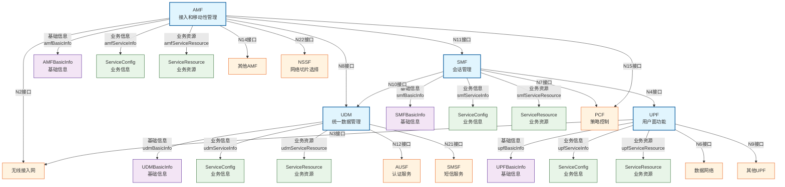
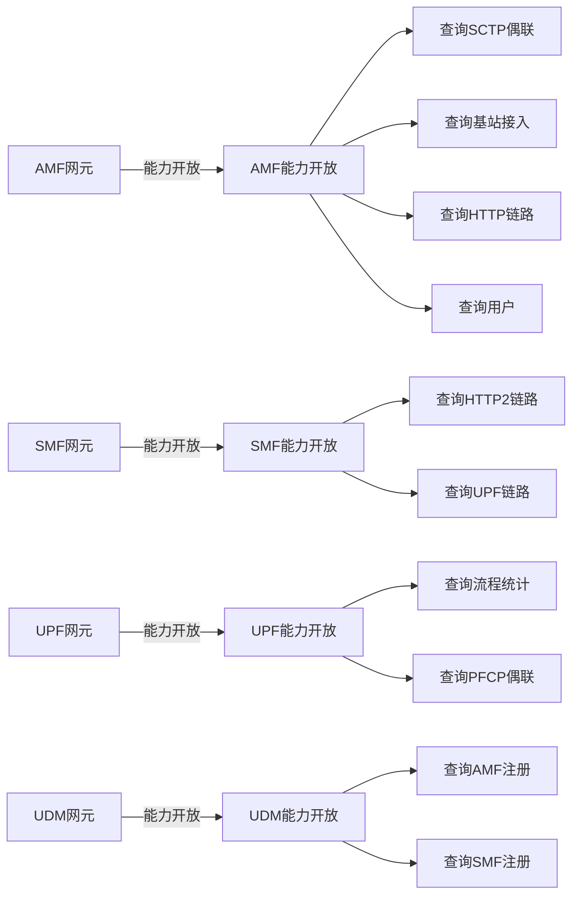
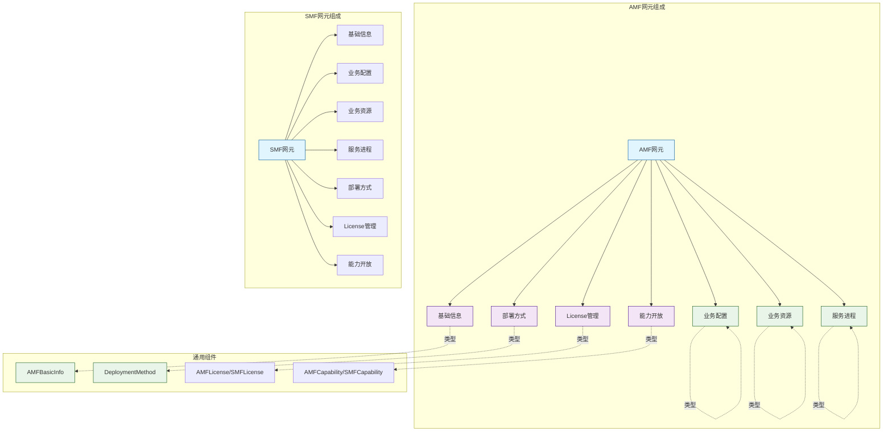

 # 5G核心网本体：核心词汇与模型规范

版本：1.0.0  
发布日期：2025-10-11  
命名空间：`http://www.asiainfo.com/ontology/5gc#`  
前缀：`5gc:`

## 目录
 
1. [命名空间与前缀](#1-命名空间与前缀)
2. [类层次结构](#2-类层次结构)
3. [核心类定义](#3-核心类定义)
4. [属性定义](#4-属性定义)
5. [枚举类型](#5-枚举类型)
6. [核心模型图](#6-核心模型图)
7. [使用示例](#7-使用示例)

## 1. 命名空间与前缀

### 1.1 本体命名空间

```turtle
@prefix 5gc: <http://www.asiainfo.com/ontology/5gc#> .
@base <http://www.asiainfo.com/ontology/5gc#> .
```

### 1.2 外部依赖命名空间

```turtle
@prefix rdf: <http://www.w3.org/1999/02/22-rdf-syntax-ns#> .
@prefix rdfs: <http://www.w3.org/2000/01/rdf-schema#> .
@prefix owl: <http://www.w3.org/2002/07/owl#> .
@prefix xsd: <http://www.w3.org/2001/XMLSchema#> .
@prefix dcterms: <http://purl.org/dc/terms/> .
```

### 1.3 版本信息

```turtle
<http://www.asiainfo.com/ontology/5gc#>
    a owl:Ontology ;
    owl:versionInfo "1.0.0" ;
    dcterms:title "5G核心网本体"@zh-CN ;
    dcterms:title "5GC Ontology"@en ;
    dcterms:description "用于描述5G核心网架构和网元管理的本体模型，涵盖AMF、SMF、UPF、UDM等核心网元"@zh-CN ;
    dcterms:creator "亚信科技 AI 研究院" ;
    dcterms:created "2025-10-11"^^xsd:date ;
    dcterms:license <http://www.apache.org/licenses/LICENSE-2.0> .
```

## 2. 类层次结构

### 2.1 顶层类架构

```
owl:Thing
├── 5gc:NetworkFunction           # 网元基类
│   ├── 5gc:AMF                   # 接入和移动性管理功能
│   ├── 5gc:SMF                   # 会话管理功能
│   ├── 5gc:UPF                   # 用户面功能
│   └── 5gc:UDM                   # 统一数据管理
├── 5gc:Interface                 # 接口基类
├── 5gc:ServiceComponent          # 网元服务进程
├── 5gc:ServiceConfig             # 业务信息
├── 5gc:ServiceResource           # 业务资源
├── 5gc:DeploymentMethod          # 部署方式抽象类
│   ├── 5gc:DockerDeployment      # Docker容器部署
│   └── 5gc:KubernetesDeployment  # Kubernetes部署
├── 5gc:License                   # License基类
│   ├── 5gc:AMFLicense            # AMF License
│   ├── 5gc:SMFLicense            # SMF License
│   ├── 5gc:UPFLicense            # UPF License
│   └── 5gc:UDMLicense            # UDM License
├── 5gc:CapabilityExposure        # 能力开放基类
│   └── 5gc:NECapabilityExposure  # 网元能力开放基类
│       ├── 5gc:AMFCapabilityExposure  # AMF能力开放
│       ├── 5gc:SMFCapabilityExposure  # SMF能力开放
│       ├── 5gc:UPFCapabilityExposure  # UPF能力开放
│       └── 5gc:UDMCapabilityExposure  # UDM能力开放
└── 5gc:Function                  # 功能操作类
```

### 2.2 基本信息类

```
5gc:BasicInfo
├── 5gc:AMFBasicInfo     # AMF基本信息
├── 5gc:SMFBasicInfo     # SMF基本信息
├── 5gc:UPFBasicInfo     # UPF基本信息
└── 5gc:UDMBasicInfo     # UDM基本信息
```

## 3. 核心类定义

### 3.1 网元基类（NetworkFunction）

```turtle
5gc:NetworkFunction a owl:Class ;
    rdfs:label "网元基类"@zh-CN ;
    rdfs:label "Network Function"@en ;
    rdfs:comment "5G核心网网元的抽象基类，包含所有网元的通用属性和关系"@zh-CN ;
    rdfs:subClassOf [
        a owl:Restriction ;
        owl:onProperty 5gc:neType ;
        owl:cardinality 1
    ] ;
    rdfs:subClassOf [
        a owl:Restriction ;
        owl:onProperty 5gc:neId ;
        owl:cardinality 1
    ] ;
    rdfs:subClassOf [
        a owl:Restriction ;
        owl:onProperty 5gc:neName ;
        owl:maxCardinality 1
    ] .
```

**属性约束**：
- `neType`: 必填，网元类型
- `neId`: 必填，网元标识
- `neName`: 可选，网元名称

### 3.2 AMF类（Access and Mobility Management Function）

```turtle
5gc:AMF a owl:Class ;
    rdfs:subClassOf 5gc:NetworkFunction ;
    rdfs:label "AMF网元"@zh-CN ;
    rdfs:label "AMF"@en ;
    rdfs:comment "AMF（Access and Mobility Management Function）是5G核心网控制面的核心网元，承担接入控制、移动性管理和信令路由的核心职责"@zh-CN ;
    rdfs:subClassOf [
        a owl:Restriction ;
        owl:onProperty 5gc:amfBasicInfo ;
        owl:cardinality 1
    ] ;
    rdfs:subClassOf [
        a owl:Restriction ;
        owl:onProperty 5gc:amfServiceInfo ;
        owl:maxCardinality 1
    ] ;
    rdfs:subClassOf [
        a owl:Restriction ;
        owl:onProperty 5gc:amfServiceResource ;
        owl:maxCardinality 1
    ] ;
    rdfs:subClassOf [
        a owl:Restriction ;
        owl:onProperty 5gc:amfSpComponent ;
        owl:minCardinality 1
    ] ;
    rdfs:subClassOf [
        a owl:Restriction ;
        owl:onProperty 5gc:amfDeployedUsingMethod ;
        owl:cardinality 1
    ] ;
    rdfs:subClassOf [
        a owl:Restriction ;
        owl:onProperty 5gc:n2Interface ;
        owl:minCardinality 1
    ] ;
    rdfs:subClassOf [
        a owl:Restriction ;
        owl:onProperty 5gc:n8Interface ;
        owl:minCardinality 1
    ] ;
    rdfs:subClassOf [
        a owl:Restriction ;
        owl:onProperty 5gc:n11Interface ;
        owl:minCardinality 1
    ] ;
    rdfs:subClassOf [
        a owl:Restriction ;
        owl:onProperty 5gc:amfLicense ;
        owl:cardinality 1
    ] ;
    rdfs:subClassOf [
        a owl:Restriction ;
        owl:onProperty 5gc:amfCapability ;
        owl:cardinality 1
    ] .
```

### 3.3 SMF类（Session Management Function）

```turtle
5gc:SMF a owl:Class ;
    rdfs:subClassOf 5gc:NetworkFunction ;
    rdfs:label "SMF网元"@zh-CN ;
    rdfs:label "SMF"@en ;
    rdfs:comment "SMF（会话管理功能）是5G核心网控制面网元，核心职责是管理用户数据会话的生命周期、连接性和服务质量"@zh-CN ;
    rdfs:subClassOf [
        a owl:Restriction ;
        owl:onProperty 5gc:smfBasicInfo ;
        owl:cardinality 1
    ] ;
    rdfs:subClassOf [
        a owl:Restriction ;
        owl:onProperty 5gc:smfServiceInfo ;
        owl:maxCardinality 1
    ] ;
    rdfs:subClassOf [
        a owl:Restriction ;
        owl:onProperty 5gc:smfServiceResource ;
        owl:maxCardinality 1
    ] ;
    rdfs:subClassOf [
        a owl:Restriction ;
        owl:onProperty 5gc:smfSpComponent ;
        owl:minCardinality 1
    ] ;
    rdfs:subClassOf [
        a owl:Restriction ;
        owl:onProperty 5gc:smfDeployedUsingMethod ;
        owl:cardinality 1
    ] ;
    rdfs:subClassOf [
        a owl:Restriction ;
        owl:onProperty 5gc:n4Interface ;
        owl:minCardinality 1
    ] ;
    rdfs:subClassOf [
        a owl:Restriction ;
        owl:onProperty 5gc:n10Interface ;
        owl:minCardinality 1
    ] ;
    rdfs:subClassOf [
        a owl:Restriction ;
        owl:onProperty 5gc:n11Interface ;
        owl:minCardinality 1
    ] ;
    rdfs:subClassOf [
        a owl:Restriction ;
        owl:onProperty 5gc:n7Interface ;
        owl:minCardinality 1
    ] ;
    rdfs:subClassOf [
        a owl:Restriction ;
        owl:onProperty 5gc:smfLicense ;
        owl:cardinality 1
    ] ;
    rdfs:subClassOf [
        a owl:Restriction ;
        owl:onProperty 5gc:smfCapability ;
        owl:cardinality 1
    ] .
```

### 3.4 UPF类（User Plane Function）

```turtle
5gc:UPF a owl:Class ;
    rdfs:subClassOf 5gc:NetworkFunction ;
    rdfs:label "UPF网元"@zh-CN ;
    rdfs:label "UPF"@en ;
    rdfs:comment "UPF（用户面管理功能）是5G核心网用户面网元，负责处理用户面数据的路由和转发"@zh-CN ;
    rdfs:subClassOf [
        a owl:Restriction ;
        owl:onProperty 5gc:upfBasicInfo ;
        owl:cardinality 1
    ] ;
    rdfs:subClassOf [
        a owl:Restriction ;
        owl:onProperty 5gc:upfServiceInfo ;
        owl:maxCardinality 1
    ] ;
    rdfs:subClassOf [
        a owl:Restriction ;
        owl:onProperty 5gc:upfServiceResource ;
        owl:maxCardinality 1
    ] ;
    rdfs:subClassOf [
        a owl:Restriction ;
        owl:onProperty 5gc:upfSpComponent ;
        owl:minCardinality 1
    ] ;
    rdfs:subClassOf [
        a owl:Restriction ;
        owl:onProperty 5gc:upfDeployedUsingMethod ;
        owl:cardinality 1
    ] ;
    rdfs:subClassOf [
        a owl:Restriction ;
        owl:onProperty 5gc:n3Interface ;
        owl:minCardinality 1
    ] ;
    rdfs:subClassOf [
        a owl:Restriction ;
        owl:onProperty 5gc:n4Interface ;
        owl:minCardinality 1
    ] ;
    rdfs:subClassOf [
        a owl:Restriction ;
        owl:onProperty 5gc:n6Interface ;
        owl:minCardinality 1
    ] ;
    rdfs:subClassOf [
        a owl:Restriction ;
        owl:onProperty 5gc:upfLicense ;
        owl:cardinality 1
    ] ;
    rdfs:subClassOf [
        a owl:Restriction ;
        owl:onProperty 5gc:upfCapability ;
        owl:cardinality 1
    ] .
```

### 3.5 UDM类（Unified Data Management）

```turtle
5gc:UDM a owl:Class ;
    rdfs:subClassOf 5gc:NetworkFunction ;
    rdfs:label "UDM网元"@zh-CN ;
    rdfs:label "UDM"@en ;
    rdfs:comment "UDM（统一数据管理）负责用户数据管理和认证"@zh-CN ;
    rdfs:subClassOf [
        a owl:Restriction ;
        owl:onProperty 5gc:udmBasicInfo ;
        owl:cardinality 1
    ] ;
    rdfs:subClassOf [
        a owl:Restriction ;
        owl:onProperty 5gc:udmServiceInfo ;
        owl:maxCardinality 1
    ] ;
    rdfs:subClassOf [
        a owl:Restriction ;
        owl:onProperty 5gc:udmServiceResource ;
        owl:maxCardinality 1
    ] ;
    rdfs:subClassOf [
        a owl:Restriction ;
        owl:onProperty 5gc:udmSpComponent ;
        owl:minCardinality 1
    ] ;
    rdfs:subClassOf [
        a owl:Restriction ;
        owl:onProperty 5gc:udmDeployedUsingMethod ;
        owl:cardinality 1
    ] ;
    rdfs:subClassOf [
        a owl:Restriction ;
        owl:onProperty 5gc:n8Interface ;
        owl:minCardinality 1
    ] ;
    rdfs:subClassOf [
        a owl:Restriction ;
        owl:onProperty 5gc:n10Interface ;
        owl:minCardinality 1
    ] ;
    rdfs:subClassOf [
        a owl:Restriction ;
        owl:onProperty 5gc:n12Interface ;
        owl:minCardinality 1
    ] ;
    rdfs:subClassOf [
        a owl:Restriction ;
        owl:onProperty 5gc:n21Interface ;
        owl:minCardinality 1
    ] ;
    rdfs:subClassOf [
        a owl:Restriction ;
        owl:onProperty 5gc:udmLicense ;
        owl:cardinality 1
    ] ;
    rdfs:subClassOf [
        a owl:Restriction ;
        owl:onProperty 5gc:udmCapability ;
        owl:cardinality 1
    ] .
```

### 3.6 接口类（Interface）

```turtle
5gc:Interface a owl:Class ;
    rdfs:label "接口基类"@zh-CN ;
    rdfs:label "Interface"@en ;
    rdfs:comment "5G核心网接口的抽象基类，包含接口的基本属性和连接关系"@zh-CN ;
    rdfs:subClassOf [
        a owl:Restriction ;
        owl:onProperty 5gc:interfaceType ;
        owl:cardinality 1
    ] ;
    rdfs:subClassOf [
        a owl:Restriction ;
        owl:onProperty 5gc:ipType ;
        owl:cardinality 1
    ] ;
    rdfs:subClassOf [
        a owl:Restriction ;
        owl:onProperty 5gc:ipAddr ;
        owl:cardinality 1
    ] ;
    rdfs:subClassOf [
        a owl:Restriction ;
        owl:onProperty 5gc:ipMask ;
        owl:cardinality 1
    ] ;
    rdfs:subClassOf [
        a owl:Restriction ;
        owl:onProperty 5gc:status ;
        owl:cardinality 1
    ] ;
    rdfs:subClassOf [
        a owl:Restriction ;
        owl:onProperty 5gc:ne ;
        owl:cardinality 1
    ] ;
    rdfs:subClassOf [
        a owl:Restriction ;
        owl:onProperty 5gc:adjNe ;
        owl:cardinality 1
    ] ;
    rdfs:subClassOf [
        a owl:Restriction ;
        owl:onProperty 5gc:connectTo ;
        owl:maxCardinality 1
    ] .
```

### 3.7 能力开放类（CapabilityExposure）

```turtle
5gc:NECapabilityExposure a owl:Class ;
    rdfs:subClassOf 5gc:CapabilityExposure ;
    rdfs:label "网元能力开放基类"@zh-CN ;
    rdfs:label "NE Capability Exposure"@en ;
    rdfs:comment "网元能力开放基类，提供网元相关的公共能力工具"@zh-CN ;
    rdfs:subClassOf [
        a owl:Restriction ;
        owl:onProperty 5gc:NECapabilityExposure ;
        owl:cardinality 1
    ] .

5gc:AMFCapabilityExposure a owl:Class ;
    rdfs:subClassOf 5gc:NECapabilityExposure ;
    rdfs:label "AMF能力开放类"@zh-CN ;
    rdfs:label "AMF Capability Exposure"@en ;
    rdfs:comment "AMF能力开放类，提供AMF相关的能力工具"@zh-CN ;
    rdfs:subClassOf [
        a owl:Restriction ;
        owl:onProperty 5gc:QuerySctp ;
        owl:cardinality 1
    ] ;
    rdfs:subClassOf [
        a owl:Restriction ;
        owl:onProperty 5gc:QueryRan ;
        owl:cardinality 1
    ] ;
    rdfs:subClassOf [
        a owl:Restriction ;
        owl:onProperty 5gc:QueryHttp ;
        owl:cardinality 1
    ] ;
    rdfs:subClassOf [
        a owl:Restriction ;
        owl:onProperty 5gc:QueryAmfUser ;
        owl:cardinality 1
    ] .
```

## 4. 属性定义

### 4.1 对象属性（Object Properties）

| 属性名 | 域（Domain） | 值域（Range） | 说明 | 特性 |
|--------|-------------|--------------|------|------|
| 5gc:amfBasicInfo | 5gc:AMF | 5gc:AMFBasicInfo | AMF基础信息 | 功能属性 |
| 5gc:smfBasicInfo | 5gc:SMF | 5gc:SMFBasicInfo | SMF基础信息 | 功能属性 |
| 5gc:upfBasicInfo | 5gc:UPF | 5gc:UPFBasicInfo | UPF基础信息 | 功能属性 |
| 5gc:udmBasicInfo | 5gc:UDM | 5gc:UDMBasicInfo | UDM基础信息 | 功能属性 |
| 5gc:amfServiceInfo | 5gc:AMF | 5gc:ServiceConfig | AMF业务信息 | - |
| 5gc:smfServiceInfo | 5gc:SMF | 5gc:ServiceConfig | SMF业务信息 | - |
| 5gc:upfServiceInfo | 5gc:UPF | 5gc:ServiceConfig | UPF业务信息 | - |
| 5gc:udmServiceInfo | 5gc:UDM | 5gc:ServiceConfig | UDM业务信息 | - |
| 5gc:amfServiceResource | 5gc:AMF | 5gc:ServiceResource | AMF业务资源 | - |
| 5gc:smfServiceResource | 5gc:SMF | 5gc:ServiceResource | SMF业务资源 | - |
| 5gc:upfServiceResource | 5gc:UPF | 5gc:ServiceResource | UPF业务资源 | - |
| 5gc:udmServiceResource | 5gc:UDM | 5gc:ServiceResource | UDM业务资源 | - |
| 5gc:amfSpComponent | 5gc:AMF | 5gc:ServiceComponent | AMF服务进程 | - |
| 5gc:smfSpComponent | 5gc:SMF | 5gc:ServiceComponent | SMF服务进程 | - |
| 5gc:upfSpComponent | 5gc:UPF | 5gc:ServiceComponent | UPF服务进程 | - |
| 5gc:udmSpComponent | 5gc:UDM | 5gc:ServiceComponent | UDM服务进程 | - |
| 5gc:amfDeployedUsingMethod | 5gc:AMF | 5gc:DeploymentMethod | AMF部署方式 | 功能属性 |
| 5gc:smfDeployedUsingMethod | 5gc:SMF | 5gc:DeploymentMethod | SMF部署方式 | 功能属性 |
| 5gc:upfDeployedUsingMethod | 5gc:UPF | 5gc:DeploymentMethod | UPF部署方式 | 功能属性 |
| 5gc:udmDeployedUsingMethod | 5gc:UDM | 5gc:DeploymentMethod | UDM部署方式 | 功能属性 |
| 5gc:n2Interface | 5gc:AMF | 5gc:Interface | N2接口(AMF-GNB) | - |
| 5gc:n3Interface | 5gc:UPF | 5gc:Interface | N3接口(UPF-GNB) | - |
| 5gc:n4Interface | 5gc:SMF, 5gc:UPF | 5gc:Interface | N4接口(SMF-UPF) | - |
| 5gc:n8Interface | 5gc:AMF, 5gc:UDM | 5gc:Interface | N8接口(AMF-UDM) | - |
| 5gc:n10Interface | 5gc:SMF, 5gc:UDM | 5gc:Interface | N10接口(SMF-UDM) | - |
| 5gc:n11Interface | 5gc:AMF, 5gc:SMF | 5gc:Interface | N11接口(AMF-SMF) | - |
| 5gc:ne | 5gc:Interface | 5gc:NetworkFunction | 接口本端网元 | 功能属性 |
| 5gc:adjNe | 5gc:Interface | 5gc:NetworkFunction | 接口对端网元 | 功能属性 |
| 5gc:connectTo | 5gc:Interface | 5gc:Interface | 接口对端信息 | - |
| 5gc:amfLicense | 5gc:AMF | 5gc:AMFLicense | AMF License | 功能属性 |
| 5gc:smfLicense | 5gc:SMF | 5gc:SMFLicense | SMF License | 功能属性 |
| 5gc:upfLicense | 5gc:UPF | 5gc:UPFLicense | UPF License | 功能属性 |
| 5gc:udmLicense | 5gc:UDM | 5gc:UDMLicense | UDM License | 功能属性 |
| 5gc:amfCapability | 5gc:AMF | 5gc:AMFCapabilityExposure | AMF能力开放 | 功能属性 |
| 5gc:smfCapability | 5gc:SMF | 5gc:SMFCapabilityExposure | SMF能力开放 | 功能属性 |
| 5gc:upfCapability | 5gc:UPF | 5gc:UPFCapabilityExposure | UPF能力开放 | 功能属性 |
| 5gc:udmCapability | 5gc:UDM | 5gc:UDMCapabilityExposure | UDM能力开放 | 功能属性 |

### 4.2 数据属性（Datatype Properties）

| 属性名 | 域（Domain） | 值域（Range） | 说明 | 约束 |
|--------|-------------|--------------|------|------|
| 5gc:neType | 5gc:NetworkFunction | 5gc:NEType | 网元类型 | 枚举值 |
| 5gc:neId | 5gc:NetworkFunction | xsd:integer | 网元标识 | 功能属性 |
| 5gc:neName | 5gc:NetworkFunction | xsd:string | 网元名称 | - |
| 5gc:interfaceType | 5gc:Interface | 5gc:InterfaceType | 接口类型 | 枚举值 |
| 5gc:ipType | 5gc:Interface | 5gc:IPType | IP类型 | 枚举值 |
| 5gc:ipAddr | 5gc:Interface | xsd:string | IP地址 | - |
| 5gc:ipMask | 5gc:Interface | xsd:integer | IP掩码 | - |
| 5gc:status | 5gc:Interface | 5gc:InterfaceStatus | 接口状态 | 枚举值 |
| 5gc:totalUsers | 5gc:AMFLicense, 5gc:UDMLicense | xsd:integer | 总用户数 | 最小值：0 |
| 5gc:usersPerUnit | 5gc:AMFLicense, 5gc:UDMLicense | xsd:integer | 每业务单元用户数 | 最小值：0 |
| 5gc:maxUnitNum | 5gc:AMFLicense, 5gc:SMFLicense, 5gc:UDMLicense | xsd:integer | 业务单元最大个数 | 最小值：0 |
| 5gc:totalSessions | 5gc:SMFLicense | xsd:integer | 总会话数容量 | 最小值：0 |
| 5gc:sessionsPerUnit | 5gc:SMFLicense | xsd:integer | 每业务单元会话数 | 最小值：0 |
| 5gc:upfSpSessNum | 5gc:UPFLicense | xsd:integer | 每业务单元会话数 | 最小值：0 |
| 5gc:upfSpBandWidth | 5gc:UPFLicense | xsd:integer | 每业务单元最大带宽(Mbps) | 最小值：0 |
| 5gc:upfSpNum | 5gc:UPFLicense | xsd:integer | 业务单元最大个数 | 最小值：0 |

## 5. 枚举类型

### 5.1 网元类型枚举

```turtle
# 网元类型
5gc:NEType a owl:Class ;
    rdfs:subClassOf skos:Concept ;
    owl:oneOf (
        5gc:AMF      # AMF网元
        5gc:SMF      # SMF网元
        5gc:UPF      # UPF网元
        5gc:UDM      # UDM网元
    ) .
```

### 5.2 接口类型枚举

```turtle
# 接口类型
5gc:InterfaceType a owl:Class ;
    rdfs:subClassOf skos:Concept ;
    owl:oneOf (
        5gc:InfterfaceN2        # N2接口
        5gc:InfterfaceN3        # N3接口
        5gc:InfterfaceN4        # N4接口
        5gc:InfterfaceN6        # N6接口
        5gc:InfterfaceN7        # N7接口
        5gc:InfterfaceN8        # N8接口
        5gc:InfterfaceN9        # N9接口
        5gc:InfterfaceN10       # N10接口
        5gc:InfterfaceN11       # N11接口
        5gc:InfterfaceN12       # N12接口
        5gc:InfterfaceN14       # N14接口
        5gc:InfterfaceN15       # N15接口
        5gc:InfterfaceN21       # N21接口
        5gc:InfterfaceN22       # N22接口
        5gc:InfterfaceS1u       # S1-U接口
        5gc:InfterfaceSgwuS5S8  # SGW-U S5/S8接口
        5gc:InfterfacePgwuS5S8  # PGW-U S5/S8接口
    ) .
```

### 5.3 接口状态枚举

```turtle
# 接口状态
5gc:InterfaceStatus a owl:Class ;
    rdfs:subClassOf skos:Concept ;
    owl:oneOf (
        5gc:InterfaceUnknown    # 接口未知状态
        5gc:InterfaceUp         # 接口UP状态
        5gc:InterfaceDown       # 接口DOWN状态
    ) .
```

### 5.4 IP类型枚举

```turtle
# IP类型
5gc:IPType a owl:Class ;
    rdfs:subClassOf skos:Concept ;
    owl:oneOf (
        5gc:IPv4    # IPv4地址
        5gc:IPv6    # IPv6地址
    ) .
```

## 6. 核心模型图

### 6.1 5G核心网架构模型



### 6.2 网元能力开放模型



### 6.3 网元内部组成模型



## 7. 使用示例

### 7.1 创建完整的5GC网元实例

```turtle
@prefix 5gc: <http://www.asiainfo.com/ontology/5gc#> .
@prefix ex: <http://example.org/instance/> .
@prefix xsd: <http://www.w3.org/2001/XMLSchema#> .

# AMF网元实例
ex:amf_001 a 5gc:AMF ;
    5gc:neType 5gc:AMF ;
    5gc:neId 1001 ;
    5gc:neName "AMF节点-001" ;
    5gc:amfBasicInfo [
        a 5gc:AMFBasicInfo ;
        5gc:region "北京" ;
        5gc:deploymentDate "2024-01-15"^^xsd:date ;
        5gc:version "V2.0.1"
    ] ;
    5gc:amfServiceInfo [
        a 5gc:ServiceConfig ;
        5gc:serviceStatus "Active" ;
        5gc:maxConnections 50000
    ] ;
    5gc:amfServiceResource [
        a 5gc:ServiceResource ;
        5gc:cpuCores 16 ;
        5gc:memoryGB 64 ;
        5gc:storageGB 500
    ] ;
    5gc:amfSpComponent [
        a 5gc:ServiceComponent ;
        5gc:componentName "AMF-SP-01" ;
        5gc:componentStatus "Running"
    ] ;
    5gc:amfDeployedUsingMethod 5gc:KubernetesDeployment ;
    5gc:n2Interface [
        a 5gc:Interface ;
        5gc:interfaceType 5gc:InfterfaceN2 ;
        5gc:ipType 5gc:IPv4 ;
        5gc:ipAddr "192.168.1.10" ;
        5gc:ipMask 24 ;
        5gc:status 5gc:InterfaceUp ;
        5gc:ne ex:amf_001 ;
        5gc:adjNe ex:gnb_001
    ] ;
    5gc:amfLicense [
        a 5gc:AMFLicense ;
        5gc:totalUsers 100000 ;
        5gc:usersPerUnit 10000 ;
        5gc:maxUnitNum 10
    ] ;
    5gc:amfCapability [
        a 5gc:AMFCapabilityExposure ;
        5gc:QuerySctp ex:query_sctp_function ;
        5gc:QueryRan ex:query_ran_function ;
        5gc:QueryHttp ex:query_http_function ;
        5gc:QueryAmfUser ex:query_amf_user_function
    ] .

# SMF网元实例
ex:smf_001 a 5gc:SMF ;
    5gc:neType 5gc:SMF ;
    5gc:neId 2001 ;
    5gc:neName "SMF节点-001" ;
    5gc:smfBasicInfo [
        a 5gc:SMFBasicInfo ;
        5gc:region "北京" ;
        5gc:deploymentDate "2024-01-20"^^xsd:date
    ] ;
    5gc:n4Interface [
        a 5gc:Interface ;
        5gc:interfaceType 5gc:InfterfaceN4 ;
        5gc:ipType 5gc:IPv4 ;
        5gc:ipAddr "192.168.1.20" ;
        5gc:ipMask 24 ;
        5gc:status 5gc:InterfaceUp ;
        5gc:ne ex:smf_001 ;
        5gc:adjNe ex:upf_001
    ] ;
    5gc:smfLicense [
        a 5gc:SMFLicense ;
        5gc:totalSessions 50000 ;
        5gc:sessionsPerUnit 5000 ;
        5gc:maxUnitNum 10
    ] .

# UPF网元实例
ex:upf_001 a 5gc:UPF ;
    5gc:neType 5gc:UPF ;
    5gc:neId 3001 ;
    5gc:neName "UPF节点-001" ;
    5gc:upfBasicInfo [
        a 5gc:UPFBasicInfo ;
        5gc:region "北京" ;
        5gc:deploymentDate "2024-01-25"^^xsd:date
    ] ;
    5gc:n3Interface [
        a 5gc:Interface ;
        5gc:interfaceType 5gc:InfterfaceN3 ;
        5gc:ipType 5gc:IPv4 ;
        5gc:ipAddr "192.168.1.30" ;
        5gc:ipMask 24 ;
        5gc:status 5gc:InterfaceUp
    ] ;
    5gc:upfLicense [
        a 5gc:UPFLicense ;
        5gc:upfSpSessNum 10000 ;
        5gc:upfSpBandWidth 1000 ;
        5gc:upfSpNum 5
    ] .

# UDM网元实例
ex:udm_001 a 5gc:UDM ;
    5gc:neType 5gc:UDM ;
    5gc:neId 4001 ;
    5gc:neName "UDM节点-001" ;
    5gc:udmBasicInfo [
        a 5gc:UDMBasicInfo ;
        5gc:region "北京" ;
        5gc:deploymentDate "2024-02-01"^^xsd:date
    ] ;
    5gc:n8Interface [
        a 5gc:Interface ;
        5gc:interfaceType 5gc:InfterfaceN8 ;
        5gc:ipType 5gc:IPv4 ;
        5gc:ipAddr "192.168.1.40" ;
        5gc:ipMask 24 ;
        5gc:status 5gc:InterfaceUp ;
        5gc:ne ex:udm_001 ;
        5gc:adjNe ex:amf_001
    ] ;
    5gc:udmLicense [
        a 5gc:UDMLicense ;
        5gc:totalUsers 200000 ;
        5gc:usersPerUnit 20000 ;
        5gc:maxUnitNum 10
    ] .
```

### 7.2 SPARQL查询示例

#### 查询所有AMF网元的接口信息

```sparql
PREFIX 5gc: <http://www.asiainfo.com/ontology/5gc#>
PREFIX xsd: <http://www.w3.org/2001/XMLSchema#>

SELECT ?amf ?interface ?ipAddr ?status
WHERE {
    ?amf a 5gc:AMF ;
         5gc:n2Interface ?interface .
    ?interface 5gc:ipAddr ?ipAddr ;
               5gc:status ?status .
}
```

#### 统计各类网元的License容量

```sparql
PREFIX 5gc: <http://www.asiainfo.com/ontology/5gc#>

SELECT ?neType 
       (SUM(?totalUsers) AS ?totalCapacity) 
       (AVG(?usersPerUnit) AS ?avgUnitCapacity)
WHERE {
    ?ne a 5gc:NetworkFunction ;
        5gc:neType ?neType .
    
    OPTIONAL {
        ?ne 5gc:amfLicense/5gc:totalUsers ?totalUsers .
        ?ne 5gc:amfLicense/5gc:usersPerUnit ?usersPerUnit .
    }
    OPTIONAL {
        ?ne 5gc:udmLicense/5gc:totalUsers ?totalUsers .
        ?ne 5gc:udmLicense/5gc:usersPerUnit ?usersPerUnit .
    }
}
GROUP BY ?neType
```

#### 查找状态为DOWN的接口

```sparql
PREFIX 5gc: <http://www.asiainfo.com/ontology/5gc#>

SELECT ?interface ?ne ?ipAddr
WHERE {
    ?interface a 5gc:Interface ;
               5gc:status 5gc:InterfaceDown ;
               5gc:ne ?ne ;
               5gc:ipAddr ?ipAddr .
}
```

### 7.3 推理规则示例

```turtle
# 规则1：如果AMF的N2接口状态为DOWN，推断无线接入可能存在问题
[Rule_AMFN2Down:
    (?amf a 5gc:AMF)
    (?amf 5gc:n2Interface ?interface)
    (?interface 5gc:status 5gc:InterfaceDown)
    ->
    (?amf 5gc:hasIssue 5gc:WirelessAccessIssue)
]

# 规则2：如果UPF会话数接近License限制，发出容量预警
[Rule_UPFCapacityWarning:
    (?upf a 5gc:UPF)
    (?upf 5gc:upfLicense ?license)
    (?license 5gc:upfSpSessNum ?maxSessions)
    (?upf 5gc:currentSessions ?currentSessions)
    greaterThan(?currentSessions, ?maxSessions * 0.8)
    ->
    (?upf 5gc:hasAlert 5gc:CapacityWarning)
]

# 规则3：如果AMF和UDM之间的N8接口异常，推断用户数据访问可能受影响
[Rule_AMFUDMInterfaceIssue:
    (?amf a 5gc:AMF)
    (?udm a 5gc:UDM)
    (?interface 5gc:ne ?amf ; 5gc:adjNe ?udm)
    (?interface 5gc:status 5gc:InterfaceDown)
    ->
    (?amf 5gc:hasImpact 5gc:UserDataAccessImpact)
]
```

## 8. 数据验证规则

### 8.1 必填字段验证

```shacl
@prefix sh: <http://www.w3.org/ns/shacl#> .
@prefix 5gc: <http://www.asiainfo.com/ontology/5gc#> .

5gc:NetworkFunctionShape a sh:NodeShape ;
    sh:targetClass 5gc:NetworkFunction ;
    sh:property [
        sh:path 5gc:neType ;
        sh:minCount 1 ;
        sh:maxCount 1 ;
        sh:in (5gc:AMF 5gc:SMF 5gc:UPF 5gc:UDM)
    ] ;
    sh:property [
        sh:path 5gc:neId ;
        sh:minCount 1 ;
        sh:maxCount 1 ;
        sh:datatype xsd:integer
    ] .

5gc:InterfaceShape a sh:NodeShape ;
    sh:targetClass 5gc:Interface ;
    sh:property [
        sh:path 5gc:interfaceType ;
        sh:minCount 1 ;
        sh:maxCount 1
    ] ;
    sh:property [
        sh:path 5gc:ipAddr ;
        sh:minCount 1 ;
        sh:maxCount 1 ;
        sh:datatype xsd:string
    ] .
```

### 8.2 数据范围验证

```shacl
5gc:LicenseShape a sh:NodeShape ;
    sh:targetClass 5gc:License ;
    sh:property [
        sh:path 5gc:totalUsers ;
        sh:minInclusive 0 ;
        sh:datatype xsd:integer
    ] ;
    sh:property [
        sh:path 5gc:totalSessions ;
        sh:minInclusive 0 ;
        sh:datatype xsd:integer
    ] .

5gc:InterfaceIPShape a sh:NodeShape ;
    sh:targetClass 5gc:Interface ;
    sh:property [
        sh:path 5gc:ipMask ;
        sh:minInclusive 0 ;
        sh:maxInclusive 32 ;
        sh:datatype xsd:integer
    ] .
```

## 9. 版本管理

### 9.1 版本策略

本体采用语义化版本（Semantic Versioning）：
- **主版本号**：不兼容的API修改
- **次版本号**：向下兼容的功能性新增
- **修订号**：向下兼容的问题修正

### 9.2 变更日志

| 版本 | 日期 | 变更内容 |
|------|------|----------|
| 1.0.0 | 2025-10-11 | 初始版本发布，包含AMF、SMF、UPF、UDM核心网元 |
| 1.1.0 | 计划中 | 增加PCF等控制面网元 |
| 1.2.0 | 计划中 | 增加网络切片管理和策略控制模块 |

## 10. 参考资料

- [3GPP TS 23.501 - System Architecture for the 5G System](https://www.3gpp.org/DynaReport/23501.htm)
- [3GPP TS 23.502 - Procedures for the 5G System](https://www.3gpp.org/DynaReport/23502.htm)
- [W3C OWL 2 Web Ontology Language](https://www.w3.org/TR/owl2-overview/)
- [SHACL Shapes Constraint Language](https://www.w3.org/TR/shacl/)

---

**下一步**：下载[本体定义文件](./5GC-ontology.ttl)开始使用。