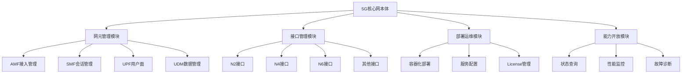

# 5G核心网本体：概览与入门

版本：1.0.0  
发布日期：2025-10-11  
作者：亚信科技 AI 研究院  
命名空间：`http://www.asiainfo.com/ontology/5gc#`  
前缀：`5gc:`

## 1. 引言与背景

### 1.1 设计背景

在5G网络建设和运营过程中，核心网作为整个网络的大脑和中枢，承担着复杂的控制和管理功能。传统的网络管理系统面临以下挑战：

- **架构复杂性**：5GC采用服务化架构，网元间关系复杂，难以统一管理
- **数据孤岛**：各网元配置、性能、告警数据分散，缺乏统一语义描述
- **运维效率低**：故障定位依赖人工经验，缺乏智能化分析支持

### 1.2 本体价值

5G核心网本体（5GC Ontology）通过提供标准化的概念模型和语义描述，实现：

1. **架构标准化**：统一5GC网元、接口、功能的语义定义
2. **智能化运维**：支持基于语义推理的网络状态分析和故障定位
3. **配置一致性**：构建可重用的网络配置知识库

## 2. 适用范围

### 2.1 领域覆盖

本体涵盖5G核心网的完整架构和运维管理：

- **核心网元领域**：AMF、SMF、UPF、UDM等控制面和用户面功能
- **网络接口领域**：N1-N15标准接口定义和状态管理
- **部署运维领域**：容器化部署、服务配置、资源管理
- **能力开放领域**：网元能力暴露、状态查询、性能监控

### 2.2 目标用户

- **网络规划工程师**：网络架构设计、容量规划
- **运维工程师**：故障诊断、性能优化
- **系统开发者**：构建智能化网络管理系统
- **数据分析师**：网络性能分析、预测性维护

## 3. 设计理念

### 3.1 核心原则

1. **标准驱动**：基于3GPP 5G核心网标准设计
2. **可扩展性**：支持新网元类型和接口类型的扩展
3. **实用性**：平衡语义完整性与实施复杂度
4. **云原生**：支持容器化、微服务化部署模式

### 3.2 模块化设计

本体采用模块化架构，分为四大模块：



## 4. 主要用例

### 4.1 场景一：AMF节点扩容规划

**业务背景**：某运营商计划在重点区域扩容AMF节点，需要评估现有AMF的负载情况和接口容量。

**本体应用**：

```turtle
@prefix 5gc: <http://www.asiainfo.com/ontology/5gc#> .
@prefix ex: <http://example.org/5gc/> .

# AMF节点实例
ex:amf_beijing_001 a 5gc:AMF ;
    5gc:neType 5gc:AMF ;
    5gc:neId 1001 ;
    5gc:neName "北京AMF节点-001" ;
    5gc:amfBasicInfo [
        a 5gc:AMFBasicInfo ;
        5gc:region "北京" ;
        5gc:deploymentDate "2024-01-15"^^xsd:date
    ] ;
    5gc:amfLicense [
        a 5gc:AMFLicense ;
        5gc:totalUsers 100000 ;
        5gc:usersPerUnit 10000 ;
        5gc:maxUnitNum 10
    ] ;
    5gc:n2Interface [
        a 5gc:Interface ;
        5gc:interfaceType 5gc:InfterfaceN2 ;
        5gc:ipAddr "10.1.1.10" ;
        5gc:status 5gc:InterfaceUp ;
        5gc:currentLoad 0.85 ;  # 当前负载85%
        5gc:capacityWarning true
    ] .

# 扩容分析
ex:amf_expansion_analysis a 5gc:ExpansionAnalysis ;
    5gc:analyzedNE ex:amf_beijing_001 ;
    5gc:currentUtilization 0.85 ;
    5gc:recommendedAction "紧急扩容" ;
    5gc:suggestedCapacity 150000 ;
    5gc:estimatedCost "50万元" .
```

### 4.2 场景二：批量用户上网业务失败

**业务背景**：某区域大量用户反映无法正常访问互联网业务，初步排查发现用户面数据通道异常，涉及UPF、SMF等多个网元。

**本体应用**：

```turtle
# 批量用户上网业务失败故障实例
ex:internet_access_failure_001 a 5gc:ServiceFault ;
    5gc:faultId "INTERNET-FAIL-20251012-001" ;
    5gc:detectedAt "2025-10-12T10:15:00"^^xsd:dateTime ;
    5gc:faultType 5gc:UserPlaneFailure ;
    5gc:severity 5gc:Critical ;
    5gc:affectedUsers 5000 ;
    5gc:affectedArea "某市CBD区域" ;
    5gc:serviceImpact "互联网访问", "视频流媒体", "在线游戏" ;
    
    # 涉及网元
    5gc:involvedNEs ex:upf_cbd_001, ex:smf_cbd_001, ex:amf_cbd_001 ;
    
    # 故障现象
    5gc:symptoms [
        5gc:symptomType 5gc:DataPathFailure ;
        5gc:failureRate 0.78 ;  # 78%的用户上网失败
        5gc:averageLatency 5000 ;  # 平均延迟5秒
        5gc:throughputDegradation 0.95 ;  # 吞吐量下降95%
        5gc:affectedProtocols "HTTP", "HTTPS", "DNS"
    ] ;
    
    # 用户面分析
    5gc:userPlaneAnalysis [
        5gc:n3InterfaceStatus [
            a 5gc:InterfaceStatus ;
            5gc:interface ex:upf_n3_001 ;
            5gc:status 5gc:InterfaceDegraded ;
            5gc:packetLossRate 0.25 ;  # 25%的包丢失
            5gc:throughput 100 ;  # 吞吐量100Mbps（正常应为1Gbps）
        ] ;
        5gc:n6InterfaceStatus [
            a 5gc:InterfaceStatus ;
            5gc:interface ex:upf_n6_001 ;
            5gc:status 5gc:InterfaceDown ;
            5gc:dnsResolutionFailure true ;
            5gc:externalConnectivity false
        ] ;
        5gc:n4InterfaceStatus [
            a 5gc:InterfaceStatus ;
            5gc:interface ex:smf_upf_n4 ;
            5gc:status 5gc:InterfaceUnstable ;
            5gc:sessionEstablishmentFailure 0.60 ;  # 60%的会话建立失败
            5gc:pfcpAssociationStatus 5gc:AssociationDegraded
        ]
    ] ;
    
    # 根因分析
    5gc:rootCause [
        a 5gc:RootCause ;
        5gc:causeType 5gc:UPFForwardingFailure ;
        5gc:confidence 0.88 ;
        5gc:evidence "UPF N6接口物理链路故障", 
                    "SMF无法建立用户面会话",
                    "DNS查询超时" ;
        5gc:impactedServices "所有互联网业务"
    ] ;
    
    # 解决方案
    5gc:proposedSolution [
        a 5gc:Solution ;
        5gc:solutionType 5gc:TrafficRedirect ;
        5gc:actionSteps "1. 切换UPF流量到备用节点",
                       "2. 修复N6接口物理链路", 
                       "3. 重启SMF会话管理服务",
                       "4. 验证用户面数据通道恢复" ;
        5gc:estimatedDuration "45分钟" ;
        5gc:successCriteria "用户上网成功率恢复至99.5%以上"
    ] ;
    
    # 影响评估
    5gc:impactAssessment [
        5gc:businessImpact "高" ;
        5gc:affectedEnterprises 150 ;
        5gc:estimatedRevenueLoss "50万元/小时" ;
        5gc:customerComplaints 320
    ] ;
    
    5gc:recoveryProgress [
        5gc:currentPhase "流量切换中" ;
        5gc:completionPercentage 75 ;
        5gc:restoredUsers 3750 ;
        5gc:estimatedCompletionTime "2025-10-12T11:00:00"^^xsd:dateTime
    ] .
```

### 4.3 场景三：UE注册失败故障诊断

**业务背景**：某区域大量用户反映5G终端无法正常注册到网络，初步分析发现AMF与UDM之间的认证流程异常。

**本体应用**：

```turtle
# UE注册失败故障实例
ex:ue_registration_failure_001 a 5gc:RegistrationFault ;
    5gc:faultId "REG-FAIL-20251015-001" ;
    5gc:detectedAt "2025-10-15T09:30:00"^^xsd:dateTime ;
    5gc:faultType 5gc:AuthenticationFailure ;
    5gc:severity 5gc:Critical ;
    5gc:affectedUEs 1500 ;
    5gc:affectedArea "某高新区" ;
    
    # 涉及网元
    5gc:involvedNEs ex:amf_001, ex:udm_001, ex:ausf_001 ;
    
    # 故障现象
    5gc:symptoms [
        5gc:symptomType 5gc:RegistrationReject ;
        5gc:errorCode "5GMM_CAUSE_ILLEGAL_UE" ;
        5gc:failureRate 0.65 ;  # 65%的注册请求失败
        5gc:timestamp "2025-10-15T09:00:00"^^xsd:dateTime
    ] ;
    
    # 接口状态分析
    5gc:n8InterfaceStatus [
        a 5gc:InterfaceStatus ;
        5gc:interface ex:amf_udm_n8 ;
        5gc:status 5gc:InterfaceUp ;
        5gc:messageLossRate 0.08 ;  # 8%的消息丢失
        5gc:averageResponseTime 800 ;  # 平均响应时间800ms
        5gc:anomalyDetected true
    ] ;
    
    # 根因分析
    5gc:rootCause [
        a 5gc:RootCause ;
        5gc:causeType 5gc:UDMSubscriptionDataError ;
        5gc:confidence 0.92 ;
        5gc:evidence "UDM返回的用户签约数据格式异常", 
                    "AMF解析SUCI失败",
                    "批量用户SIM卡配置问题" ;
        5gc:impactedServices "5G注册", "语音业务", "数据业务"
    ] ;
    
    # 解决方案
    5gc:proposedSolution [
        a 5gc:Solution ;
        5gc:solutionType 5gc:DataRepair ;
        5gc:actionSteps "1. 检查UDM用户数据一致性",
                       "2. 修复异常签约数据格式", 
                       "3. 重启受影响AMF服务进程",
                       "4. 验证UE注册成功率" ;
        5gc:estimatedDuration "2小时" ;
        5gc:successCriteria "UE注册成功率恢复至99.9%以上"
    ] ;
    
    5gc:recoveryProgress [
        5gc:currentPhase "数据修复中" ;
        5gc:completionPercentage 60 ;
        5gc:estimatedCompletionTime "2025-10-15T11:30:00"^^xsd:dateTime
    ] .
```

## 5. 文档导航

本体文档集包含以下内容：

### 5.1 人类可读文档

1. **概览与入门**（本文档）
   - 背景介绍、设计理念、使用场景
   
2. **[核心词汇与模型规范](./5GC-Ontology-Vocabulary-CN.md)**
   - 详细的类、属性、关系定义
   - 语义约束和使用规则
   
3. **[约束与验证规则](./5GC-Ontology-Constraints-CN.md)**（计划中）
   - SHACL形状定义
   - 数据质量验证规则

### 5.2 机器可读文件

1. **[本体定义文件](./5GC-ontology.ttl)**
   - Turtle格式的完整本体定义
   
2. **[SHACL约束文件](./5GC-shapes.ttl)**（计划中）
   - 数据验证规则

## 6. 快速上手

### 6.1 环境准备

```bash
# 安装Apache Jena（用于本体处理）
wget https://dlcdn.apache.org/jena/binaries/apache-jena-4.9.0.tar.gz
tar -xzf apache-jena-4.9.0.tar.gz

# 验证本体文件
./apache-jena-4.9.0/bin/riot --validate 5GC-ontology.ttl

# 启动Fuseki SPARQL服务器
./apache-jena-4.9.0/fuseki/fuseki-server --loc=/data/db /5gc
```

### 6.2 基础查询示例

```sparql
PREFIX 5gc: <http://www.asiainfo.com/ontology/5gc#>

# 查询所有AMF节点的接口状态
SELECT ?amf ?interface ?ipAddr ?status
WHERE {
    ?amf a 5gc:AMF ;
         5gc:n2Interface ?interface .
    ?interface 5gc:ipAddr ?ipAddr ;
               5gc:status ?status .
}
ORDER BY ?amf

# 查询License容量接近上限的网元
SELECT ?ne ?neType ?currentUsers ?maxUsers ?utilization
WHERE {
    ?ne a 5gc:NetworkFunction ;
        5gc:neType ?neType .
    
    OPTIONAL {
        ?ne 5gc:amfLicense/5gc:totalUsers ?maxUsers .
        ?ne 5gc:currentUsers ?currentUsers .
    }
    OPTIONAL {
        ?ne 5gc:udmLicense/5gc:totalUsers ?maxUsers .
        ?ne 5gc:currentUsers ?currentUsers .
    }
    BIND(?currentUsers/?maxUsers AS ?utilization)
    FILTER(?utilization > 0.8)
}
```

### 6.3 Python集成示例

```python
from rdflib import Graph, Namespace, URIRef, Literal
import requests

# 创建图并加载本体
g = Graph()
g.parse("5GC-ontology.ttl", format="turtle")

# 定义命名空间
FIVEGC = Namespace("http://www.asiainfo.com/ontology/5gc#")

# 创建新的AMF实例
amf = URIRef("http://example.org/5gc/amf/new_node_001")
g.add((amf, RDF.type, FIVEGC.AMF))
g.add((amf, FIVEGC.neId, Literal(5001)))
g.add((amf, FIVEGC.neName, Literal("新建AMF节点-001")))
g.add((amf, FIVEGC.neType, FIVEGC.AMF))

# 添加接口信息
interface = URIRef("http://example.org/5gc/interface/n2_001")
g.add((interface, RDF.type, FIVEGC.Interface))
g.add((interface, FIVEGC.interfaceType, FIVEGC.InfterfaceN2))
g.add((interface, FIVEGC.ipAddr, Literal("10.10.1.100")))
g.add((interface, FIVEGC.status, FIVEGC.InterfaceUp))
g.add((amf, FIVEGC.n2Interface, interface))

# 保存到Fuseki
update_endpoint = "http://localhost:3030/5gc/update"
data = g.serialize(format='turtle')
response = requests.post(update_endpoint, 
                        data=f"INSERT DATA {{ {data} }}",
                        headers={'Content-Type': 'application/sparql-update'})
```


## 7. 社区与贡献

### 7.1 获取帮助

- **GitHub仓库**：[https://github.com/asiainfo/5gc-ontology](https://github.com/asiainfo/5gc-ontology)
- **问题反馈**：通过GitHub Issues提交
- **邮件列表**：5gc-ontology@example.com

### 7.2 参与贡献

我们欢迎社区贡献，包括：

- **新增网元类型**：PCF、NSSF、AUSF等控制面功能
- **接口扩展**：新增接口类型和协议支持
- **部署模式**：边缘计算、网络切片等场景
- **使用案例**：分享实际部署和应用经验
- **文档改进**：多语言文档、教程和示例

详细贡献指南请参见[CONTRIBUTING.md](./CONTRIBUTING.md)。

## 8. 版权与许可

本体采用 Apache License 2.0 开源协议发布。

---

**下一步**：阅读[核心词汇与模型规范](./5GC-Ontology-Vocabulary-CN.md)了解详细的本体定义。