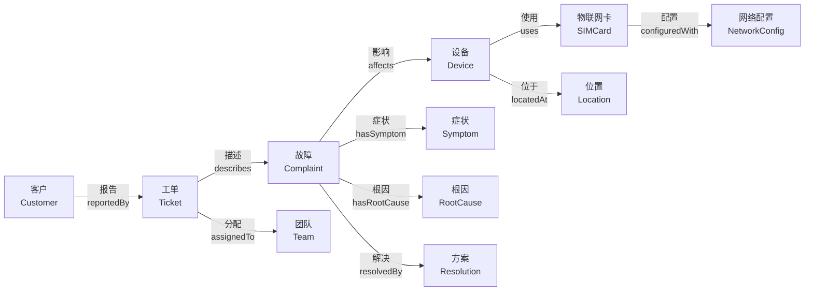
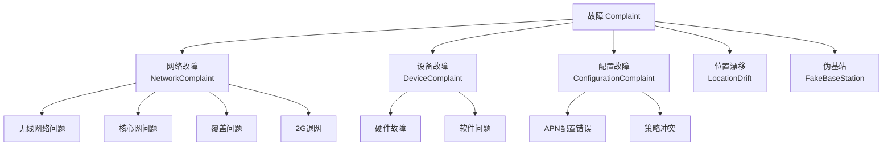

# 物联网故障工单本体：核心词汇与模型规范

版本：1.0.0  
发布日期：2025-01-08  
命名空间：`http://www.asiainfo.com/ontology/iot-Complaint-ticket#`  
前缀：`iotft:`

## 目录

1. [命名空间与前缀](#1-命名空间与前缀)
2. [类层次结构](#2-类层次结构)
3. [核心类定义](#3-核心类定义)
4. [属性定义](#4-属性定义)
5. [枚举类型](#5-枚举类型)
6. [核心模型图](#6-核心模型图)
7. [使用示例](#7-使用示例)

## 1. 命名空间与前缀

### 1.1 本体命名空间

```turtle
@prefix iotft: <http://www.asiainfo.com/ontology/iot-Complaint-ticket#> .
@base <http://www.asiainfo.com/ontology/iot-Complaint-ticket#> .
```

### 1.2 外部依赖命名空间

```turtle
@prefix rdf: <http://www.w3.org/1999/02/22-rdf-syntax-ns#> .
@prefix rdfs: <http://www.w3.org/2000/01/rdf-schema#> .
@prefix owl: <http://www.w3.org/2002/07/owl#> .
@prefix xsd: <http://www.w3.org/2001/XMLSchema#> .
@prefix foaf: <http://xmlns.com/foaf/0.1/> .
@prefix skos: <http://www.w3.org/2004/02/skos/core#> .
@prefix dcterms: <http://purl.org/dc/terms/> .
@prefix vcard: <http://www.w3.org/2006/vcard/ns#> .
```

### 1.3 版本信息

```turtle
<http://www.asiainfo.com/ontology/iot-Complaint-ticket#>
    a owl:Ontology ;
    owl:versionInfo "1.0.0" ;
    dcterms:title "物联网故障工单本体"@zh-CN ;
    dcterms:title "IoT Complaint Ticket Ontology"@en ;
    dcterms:description "用于描述物联网运营商故障工单管理的本体模型"@zh-CN ;
    dcterms:creator "亚信科技 AI 研究院" ;
    dcterms:created "2025-01-08"^^xsd:date ;
    dcterms:license <http://www.apache.org/licenses/LICENSE-2.0> .
```

## 2. 类层次结构

### 2.1 顶层类架构

```
owl:Thing
├── iotft:Ticket                 # 工单
├── iotft:Customer               # 客户
├── iotft:Service                # 服务
├── iotft:Device                 # 设备
├── iotft:SIMCard                # 物联网卡
├── iotft:Network                # 网络
├── iotft:Complaint                  # 故障（抽象基类）
│   ├── iotft:NetworkComplaint       # 网络故障
│   ├── iotft:DeviceComplaint        # 设备故障
│   ├── iotft:ConfigurationComplaint # 配置故障
│   ├── iotft:LocationDrift      # 位置漂移
│   └── iotft:FakeBaseStation    # 伪基站
├── iotft:Symptom                # 症状
├── iotft:RootCause              # 根因
├── iotft:Resolution             # 解决方案
├── iotft:Location               # 位置
├── iotft:ContactInfo            # 联系信息
├── iotft:Team                   # 团队
├── iotft:Policy                 # 策略
├── iotft:SLA                    # 服务等级协议
└── iotft:DataAnalysis           # 数据分析（抽象基类）
    ├── iotft:SignalQuality      # 信号质量
    ├── iotft:DataConsumption    # 数据消耗
    └── iotft:TimePattern        # 时间模式
```

### 2.2 外部本体对齐

| 本体类 | 对齐关系 | 外部类 | 说明 |
|--------|----------|---------|------|
| iotft:Customer | owl:equivalentClass | foaf:Organization | 客户组织 |
| iotft:ContactInfo | rdfs:subClassOf | vcard:VCard | 联系信息 |
| iotft:Location | owl:equivalentClass | geo:SpatialThing | 空间位置 |
| iotft:Service | rdfs:subClassOf | dcterms:Service | 服务 |
| iotft:Ticket | rdfs:subClassOf | skos:Concept | 概念实体 |

## 3. 核心类定义

### 3.1 工单类（Ticket）

```turtle
iotft:Ticket a owl:Class ;
    rdfs:label "故障工单"@zh-CN ;
    rdfs:label "Complaint Ticket"@en ;
    rdfs:comment "描述一个完整的故障处理工单，包括从创建到解决的全生命周期"@zh-CN ;
    rdfs:subClassOf [
        a owl:Restriction ;
        owl:onProperty iotft:hasId ;
        owl:cardinality 1
    ] ;
    rdfs:subClassOf [
        a owl:Restriction ;
        owl:onProperty iotft:hasStatus ;
        owl:cardinality 1
    ] .
```

**属性约束**：
- `hasId`: 必填，唯一标识符
- `hasStatus`: 必填，工单状态
- `hasPriority`: 必填，优先级
- `createdAt`: 必填，创建时间
- `reportedBy`: 必填，报告客户
- `describes`: 必填，描述的故障

### 3.2 故障类（Complaint）

```turtle
iotft:Complaint a owl:Class ;
    rdfs:label "故障"@zh-CN ;
    rdfs:label "Complaint"@en ;
    rdfs:comment "故障的抽象基类，所有具体故障类型都继承自此类"@zh-CN ;
    owl:disjointWith iotft:Ticket, iotft:Customer, iotft:Device .

iotft:NetworkComplaint a owl:Class ;
    rdfs:subClassOf iotft:Complaint ;
    rdfs:label "网络故障"@zh-CN ;
    rdfs:comment "与网络连接、信号覆盖相关的故障"@zh-CN .

iotft:LocationDrift a owl:Class ;
    rdfs:subClassOf iotft:Complaint ;
    rdfs:label "位置漂移"@zh-CN ;
    rdfs:comment "设备位置与实际位置不符的特殊故障类型"@zh-CN ;
    rdfs:subClassOf [
        a owl:Restriction ;
        owl:onProperty iotft:actualLocation ;
        owl:cardinality 1
    ] .
```

### 3.3 设备类（Device）

```turtle
iotft:Device a owl:Class ;
    rdfs:label "物联网设备"@zh-CN ;
    rdfs:label "IoT Device"@en ;
    rdfs:comment "使用物联网卡的终端设备"@zh-CN ;
    rdfs:subClassOf [
        a owl:Restriction ;
        owl:onProperty iotft:deviceType ;
        owl:cardinality 1
    ] ;
    rdfs:subClassOf [
        a owl:Restriction ;
        owl:onProperty iotft:uses ;
        owl:onClass iotft:SIMCard ;
        owl:qualifiedCardinality 1
    ] .
```

### 3.4 物联网卡类（SIMCard）

```turtle
iotft:SIMCard a owl:Class ;
    rdfs:label "物联网卡"@zh-CN ;
    rdfs:label "IoT SIM Card"@en ;
    rdfs:comment "用于物联网设备的SIM卡，包括实体卡和eSIM"@zh-CN ;
    owl:disjointUnionOf (iotft:USIM iotft:eSIM iotft:NanoSIM) ;
    rdfs:subClassOf [
        a owl:Restriction ;
        owl:onProperty iotft:hasICCID ;
        owl:cardinality 1
    ] ;
    rdfs:subClassOf [
        a owl:Restriction ;
        owl:onProperty iotft:hasMSISDN ;
        owl:cardinality 1
    ] .
```

## 4. 属性定义

### 4.1 对象属性（Object Properties）

| 属性名 | 域（Domain） | 值域（Range） | 说明 | 特性 |
|--------|-------------|--------------|------|------|
| iotft:describes | iotft:Ticket | iotft:Complaint | 工单描述的故障 | 功能属性 |
| iotft:reportedBy | iotft:Ticket | iotft:Customer | 报告工单的客户 | 功能属性 |
| iotft:assignedTo | iotft:Ticket | iotft:Team | 分配给的团队 | - |
| iotft:affects | iotft:Complaint | iotft:Device | 故障影响的设备 | - |
| iotft:uses | iotft:Device | iotft:SIMCard | 设备使用的SIM卡 | 功能属性 |
| iotft:boundTo | iotft:SIMCard | iotft:Device | SIM卡绑定的设备 | 反向功能属性 |
| iotft:hasRootCause | iotft:Complaint | iotft:RootCause | 故障的根因 | - |
| iotft:resolvedBy | iotft:Complaint | iotft:Resolution | 故障的解决方案 | - |
| iotft:occurredAt | iotft:Complaint | iotft:Location | 故障发生位置 | - |
| iotft:hasSymptom | iotft:Complaint | iotft:Symptom | 故障的症状 | - |
| iotft:subscribesTo | iotft:Customer | iotft:Service | 客户订阅的服务 | - |
| iotft:hasPolicy | iotft:Service | iotft:Policy | 服务的策略 | - |
| iotft:hasSLA | iotft:Service | iotft:SLA | 服务的SLA | 功能属性 |
| iotft:hasContact | iotft:Customer | iotft:ContactInfo | 客户的联系信息 | 功能属性 |
| iotft:locatedAt | iotft:Device | iotft:Location | 设备位置 | - |
| iotft:configuredWith | iotft:SIMCard | iotft:NetworkConfig | SIM卡的网络配置 | 功能属性 |

### 4.2 数据属性（Datatype Properties）

| 属性名 | 域（Domain） | 值域（Range） | 说明 | 约束 |
|--------|-------------|--------------|------|------|
| iotft:hasId | iotft:Ticket | xsd:string | 工单唯一标识符 | 功能属性 |
| iotft:createdAt | iotft:Ticket | xsd:dateTime | 创建时间 | - |
| iotft:updatedAt | iotft:Ticket | xsd:dateTime | 更新时间 | - |
| iotft:hasICCID | iotft:SIMCard | xsd:string | ICCID号码 | 功能属性，正则：^[0-9]{19,20}$ |
| iotft:hasMSISDN | iotft:SIMCard | xsd:string | MSISDN号码 | 功能属性 |
| iotft:hasIMSI | iotft:SIMCard | xsd:string | IMSI号码 | 功能属性 |
| iotft:deviceName | iotft:Device | xsd:string | 设备名称 | - |
| iotft:customerName | iotft:Customer | xsd:string | 客户名称 | - |
| iotft:primaryPhone | iotft:ContactInfo | xsd:string | 主要电话 | 正则：^1[3-9][0-9]{9}$ |
| iotft:email | iotft:ContactInfo | xsd:string | 电子邮件 | 格式：email |
| iotft:confidence | iotft:RootCause | xsd:float | 置信度 | 范围：[0,1] |
| iotft:successRate | iotft:Resolution | xsd:float | 成功率 | 范围：[0,1] |
| iotft:severity | iotft:Symptom | xsd:string | 严重程度 | 枚举值 |
| iotft:frequency | iotft:Symptom | xsd:string | 发生频率 | - |
| iotft:latitude | iotft:Location | xsd:float | 纬度 | 范围：[-90,90] |
| iotft:longitude | iotft:Location | xsd:float | 经度 | 范围：[-180,180] |
| iotft:uplinkRate | iotft:QoSProfile | xsd:integer | 上行速率(bps) | 最小值：0 |
| iotft:downlinkRate | iotft:QoSProfile | xsd:integer | 下行速率(bps) | 最小值：0 |

## 5. 枚举类型

### 5.1 工单相关枚举

```turtle
# 工单状态
iotft:TicketStatus a owl:Class ;
    rdfs:subClassOf skos:Concept ;
    owl:oneOf (
        iotft:Open          # 开放
        iotft:InProgress    # 处理中
        iotft:Pending       # 待处理
        iotft:Resolved      # 已解决
        iotft:Closed        # 已关闭
    ) .

# 优先级
iotft:Priority a owl:Class ;
    rdfs:subClassOf skos:Concept ;
    owl:oneOf (
        iotft:Urgent    # 紧急
        iotft:High      # 高
        iotft:Medium    # 中
        iotft:Low       # 低
    ) .

# 客户级别
iotft:CustomerTier a owl:Class ;
    rdfs:subClassOf skos:Concept ;
    owl:oneOf (
        iotft:Gold      # 金牌
        iotft:Silver    # 银牌
        iotft:Bronze    # 铜牌
        iotft:Standard  # 标准
    ) .
```

### 5.2 网络相关枚举

```turtle
# 网络类型
iotft:NetworkType a owl:Class ;
    rdfs:subClassOf skos:Concept ;
    owl:oneOf (
        iotft:2G
        iotft:3G
        iotft:4G
        iotft:5G
        iotft:NBIoT
    ) .

# 信号级别
iotft:SignalLevel a owl:Class ;
    rdfs:subClassOf skos:Concept ;
    owl:oneOf (
        iotft:Excellent    # 优秀
        iotft:Good         # 良好
        iotft:Fair         # 一般
        iotft:Poor         # 较差
        iotft:NoSignal     # 无信号
    ) .

# 覆盖类型
iotft:CoverageType a owl:Class ;
    rdfs:subClassOf skos:Concept ;
    owl:oneOf (
        iotft:Indoor       # 室内
        iotft:Outdoor      # 室外
        iotft:Underground  # 地下
        iotft:HighSpeed    # 高速
        iotft:Tunnel       # 隧道
    ) .
```

### 5.3 设备相关枚举

```turtle
# 设备类型
iotft:DeviceType a owl:Class ;
    rdfs:subClassOf skos:Concept ;
    owl:oneOf (
        iotft:ChargingStation           # 充电桩
        iotft:SmartMeter                # 智能电表
        iotft:VehicleTerminal           # 车载终端
        iotft:BroadcastingSpeaker       # 广播音箱
        iotft:SharedElectricVehicle     # 共享电动车
        iotft:SmartBatterySwapCabinet   # 智能换电柜
        iotft:WaterDispenserController  # 净水器控制器
        iotft:WashingMachine            # 洗衣机
        iotft:MiFi                      # 移动WiFi
        iotft:NBGasMeter                # NB燃气表
        iotft:GPS                       # GPS定位器
        iotft:POS                       # POS机
    ) .

# 卡类型
iotft:CardType a owl:Class ;
    rdfs:subClassOf skos:Concept ;
    owl:oneOf (
        iotft:USIM      # USIM卡
        iotft:eSIM      # eSIM卡
        iotft:NanoSIM   # Nano SIM卡
    ) .

# 卡状态
iotft:CardStatus a owl:Class ;
    rdfs:subClassOf skos:Concept ;
    owl:oneOf (
        iotft:Active         # 激活
        iotft:Suspended      # 暂停
        iotft:Inactive       # 未激活
        iotft:Testing        # 测试中
        iotft:BulkOffline    # 批量离线
        iotft:Terminated     # 已终止
    ) .
```

### 5.4 故障相关枚举

```turtle
# 故障类型
iotft:ComplaintType a owl:Class ;
    rdfs:subClassOf skos:Concept ;
    owl:oneOf (
        iotft:NetworkComplaintType        # 网络故障
        iotft:DeviceComplaintType         # 设备故障
        iotft:ConfigurationComplaintType  # 配置故障
        iotft:BulkComplaintType           # 批量故障
    ) .

# 网络故障子类型
iotft:NetworkComplaintSubtype a owl:Class ;
    rdfs:subClassOf skos:Concept ;
    owl:oneOf (
        iotft:WirelessNetworkIssue  # 无线网络问题
        iotft:CoreNetworkIssue      # 核心网问题
        iotft:CoverageIssue         # 覆盖问题
        iotft:2GNetworkSunset       # 2G退网
    ) .

# 症状类型
iotft:SymptomType a owl:Class ;
    rdfs:subClassOf skos:Concept ;
    owl:oneOf (
        iotft:NoConnection   # 无连接
        iotft:SlowSpeed      # 速度慢
        iotft:HighLatency    # 高延迟
        iotft:WeakSignal     # 信号弱
        iotft:BulkOffline    # 批量离线
    ) .

# 根因类型
iotft:CauseType a owl:Class ;
    rdfs:subClassOf skos:Concept ;
    owl:oneOf (
        iotft:SignalCoverage        # 信号覆盖
        iotft:NetworkCongestion     # 网络拥塞
        iotft:ConfigError           # 配置错误
        iotft:DeviceFailure         # 设备故障
        iotft:PolicyRestriction     # 策略限制
        iotft:ExternalInterference  # 外部干扰
    ) .

# 解决方案类型
iotft:ResolutionType a owl:Class ;
    rdfs:subClassOf skos:Concept ;
    owl:oneOf (
        iotft:NetworkOptimization  # 网络优化
        iotft:ConfigChange         # 配置变更
        iotft:DeviceReplace        # 设备更换
        iotft:PolicyUpdate         # 策略更新
        iotft:ManualIntervention   # 人工干预
    ) .
```

## 6. 核心模型图

### 6.1 工单处理流程模型



### 6.2 故障分类体系



## 7. 使用示例

### 7.1 创建完整的故障工单实例

```turtle
@prefix iotft: <http://www.asiainfo.com/ontology/iot-Complaint-ticket#> .
@prefix ex: <http://example.org/instance/> .
@prefix xsd: <http://www.w3.org/2001/XMLSchema#> .

# 客户实例
ex:customer_youyou a iotft:Customer ;
    iotft:customerName "某科技有限公司" ;
    iotft:hasTier iotft:Bronze ;
    iotft:hasContact [
        a iotft:ContactInfo ;
        iotft:primaryPhone "138XXXX0001" ;
        iotft:email "support@example.com" ;
        iotft:availability "工作时间 9:00-18:00"
    ] ;
    iotft:subscribesTo ex:service_iot_basic .

# 服务实例
ex:service_iot_basic a iotft:Service ;
    iotft:serviceType iotft:IoTService ;
    iotft:hasSLA [
        a iotft:SLA ;
        iotft:availability 0.999 ;
        iotft:responseTime "4小时" ;
        iotft:resolutionTime "24小时"
    ] .

# 设备实例
ex:charging_station_001 a iotft:Device ;
    iotft:deviceName "4G充电桩-001" ;
    iotft:deviceType iotft:ChargingStation ;
    iotft:uses ex:sim_001 ;
    iotft:locatedAt [
        a iotft:Location ;
        iotft:locationType iotft:Underground ;
        iotft:province "某省" ;
        iotft:city "某市" ;
        iotft:district "某区" ;
        iotft:address "某路某小区地下室非机动车库" ;
        iotft:latitude 31.8639 ;
        iotft:longitude 117.3269
    ] .

# SIM卡实例
ex:sim_001 a iotft:SIMCard ;
    iotft:hasICCID "89860XXXXXXXXXXXXXX" ;
    iotft:hasMSISDN "144XXXXXXXXX" ;
    iotft:hasIMSI "460XXXXXXXXXXX" ;
    iotft:cardType iotft:USIM ;
    iotft:cardStatus iotft:Active ;
    iotft:configuredWith [
        a iotft:NetworkConfig ;
        iotft:hasAPN [
            a iotft:APN ;
            iotft:apnName "CMIOT" ;
            iotft:apnType iotft:Generic
        ] ;
        iotft:hasCapabilities iotft:2G, iotft:3G, iotft:4G ;
        iotft:hasRestrictions [
            a iotft:AccessRestriction ;
            iotft:networkType iotft:2G ;
            iotft:restrictionLevel iotft:Restricted ;
            iotft:reason "2G网络即将退网"
        ]
    ] .

# 故障实例
ex:Complaint_frequent_offline a iotft:NetworkComplaint ;
    iotft:ComplaintType iotft:NetworkComplaintType ;
    iotft:hasSubtype iotft:CoverageIssue ;
    iotft:hasSymptom [
        a iotft:Symptom ;
        iotft:symptomType iotft:NoConnection ;
        iotft:severity iotft:High ;
        iotft:frequency "每天3-5次，无规律"
    ] ;
    iotft:occurredAt ex:charging_station_001/locatedAt ;
    iotft:affects ex:charging_station_001, ex:charging_station_002, 
                  ex:charging_station_003, ex:charging_station_004 ;
    iotft:detectedAt "2025-03-06T10:01:00"^^xsd:dateTime ;
    iotft:hasRootCause [
        a iotft:RootCause ;
        iotft:causeType iotft:SignalCoverage ;
        iotft:confidence 0.85 ;
        iotft:evidence "地下环境信号衰减严重", "RSRP值低于-110dBm"
    ] .

# 工单实例
ex:ticket_20250306_001 a iotft:Ticket ;
    iotft:hasId "JT-XXX-XXXXXX-XXXXXX-X-XXXX" ;
    iotft:hasStatus iotft:InProgress ;
    iotft:hasPriority iotft:High ;
    iotft:createdAt "2025-03-06T10:57:21"^^xsd:dateTime ;
    iotft:updatedAt "2025-03-06T11:30:00"^^xsd:dateTime ;
    iotft:reportedBy ex:customer_youyou ;
    iotft:describes ex:Complaint_frequent_offline ;
    iotft:assignedTo [
        a iotft:Team ;
        iotft:teamName "无线优化团队" ;
        iotft:teamType iotft:WirelessOpt
    ] ;
    iotft:requires [
        a iotft:TestCoordination ;
        iotft:contactPerson "客户技术负责人" ;
        iotft:contactPhone "138XXXX0001" ;
        iotft:availableTime iotft:Anytime ;
        iotft:testType iotft:SignalTest ;
        iotft:cooperationLevel iotft:High
    ] ;
    iotft:processingDeadline "2025-03-07T05:57:00"^^xsd:dateTime .

# 解决方案实例
ex:resolution_signal_enhancement a iotft:Resolution ;
    iotft:resolutionType iotft:NetworkOptimization ;
    iotft:implementedBy ex:team_wireless_opt ;
    iotft:implementationTime "2025-03-07T14:30:00"^^xsd:dateTime ;
    iotft:action "部署室内分布系统增强地下室信号覆盖" ;
    iotft:successRate 0.92 ;
    iotft:notes "建议在地下车库安装2个室内天线，覆盖充电桩区域" .

# 建立解决关系
ex:Complaint_frequent_offline iotft:resolvedBy ex:resolution_signal_enhancement .
```

### 7.2 SPARQL查询示例

#### 查询所有高优先级的网络故障

```sparql
PREFIX iotft: <http://www.asiainfo.com/ontology/iot-Complaint-ticket#>
PREFIX xsd: <http://www.w3.org/2001/XMLSchema#>

SELECT ?ticket ?Complaint ?customer ?rootCause
WHERE {
    ?ticket a iotft:Ticket ;
            iotft:hasPriority iotft:High ;
            iotft:describes ?Complaint ;
            iotft:reportedBy ?customer .
    ?Complaint a iotft:NetworkComplaint ;
           iotft:hasRootCause ?rootCause .
    ?rootCause iotft:causeType ?causeType ;
               iotft:confidence ?confidence .
    FILTER(?confidence > 0.7)
}
ORDER BY DESC(?confidence)
```

#### 统计各类设备的故障数量

```sparql
PREFIX iotft: <http://www.asiainfo.com/ontology/iot-Complaint-ticket#>

SELECT ?deviceType (COUNT(?Complaint) AS ?ComplaintCount)
WHERE {
    ?Complaint a iotft:Complaint ;
           iotft:affects ?device .
    ?device iotft:deviceType ?deviceType .
}
GROUP BY ?deviceType
ORDER BY DESC(?ComplaintCount)
```

#### 查找地下环境的所有故障

```sparql
PREFIX iotft: <http://www.asiainfo.com/ontology/iot-Complaint-ticket#>

SELECT ?Complaint ?location ?symptom
WHERE {
    ?Complaint a iotft:Complaint ;
           iotft:occurredAt ?location ;
           iotft:hasSymptom ?symptom .
    ?location iotft:locationType iotft:Underground .
}
```

### 7.3 推理规则示例

```turtle
# 规则1：如果故障影响超过100个设备，自动设置为紧急优先级
[Rule_MassiveComplaint:
    (?ticket iotft:describes ?Complaint)
    (?Complaint iotft:affects ?device)
    countDistinct(?device, ?count)
    greaterThan(?count, 100)
    ->
    (?ticket iotft:hasPriority iotft:Urgent)
]

# 规则2：地下环境的网络故障，推断根因为信号覆盖问题
[Rule_UndergroundCoverage:
    (?Complaint a iotft:NetworkComplaint)
    (?Complaint iotft:occurredAt ?location)
    (?location iotft:locationType iotft:Underground)
    ->
    (?Complaint iotft:hasRootCause [
        iotft:causeType iotft:SignalCoverage ;
        iotft:confidence 0.8
    ])
]

# 规则3：2G设备在2025年后的故障，关联到2G退网
[Rule_2GSunset:
    (?device iotft:hasCapability iotft:2GOnly)
    (?Complaint iotft:affects ?device)
    (?Complaint iotft:detectedAt ?date)
    greaterThan(?date, "2025-01-01"^^xsd:date)
    ->
    (?Complaint iotft:hasSubtype iotft:2GNetworkSunset)
]
```

## 8. 数据验证规则

### 8.1 必填字段验证

```shacl
@prefix sh: <http://www.w3.org/ns/shacl#> .
@prefix iotft: <http://www.asiainfo.com/ontology/iot-Complaint-ticket#> .

iotft:TicketShape a sh:NodeShape ;
    sh:targetClass iotft:Ticket ;
    sh:property [
        sh:path iotft:hasId ;
        sh:minCount 1 ;
        sh:maxCount 1 ;
        sh:datatype xsd:string
    ] ;
    sh:property [
        sh:path iotft:hasStatus ;
        sh:minCount 1 ;
        sh:maxCount 1 ;
        sh:in (iotft:Open iotft:InProgress iotft:Pending iotft:Resolved iotft:Closed)
    ] ;
    sh:property [
        sh:path iotft:reportedBy ;
        sh:minCount 1 ;
        sh:class iotft:Customer
    ] .
```

### 8.2 数据范围验证

```shacl
iotft:LocationShape a sh:NodeShape ;
    sh:targetClass iotft:Location ;
    sh:property [
        sh:path iotft:latitude ;
        sh:minInclusive -90 ;
        sh:maxInclusive 90 ;
        sh:datatype xsd:float
    ] ;
    sh:property [
        sh:path iotft:longitude ;
        sh:minInclusive -180 ;
        sh:maxInclusive 180 ;
        sh:datatype xsd:float
    ] .

iotft:RootCauseShape a sh:NodeShape ;
    sh:targetClass iotft:RootCause ;
    sh:property [
        sh:path iotft:confidence ;
        sh:minInclusive 0.0 ;
        sh:maxInclusive 1.0 ;
        sh:datatype xsd:float
    ] .
```

## 9. 版本管理

### 9.1 版本策略

本体采用语义化版本（Semantic Versioning）：
- **主版本号**：不兼容的API修改
- **次版本号**：向下兼容的功能性新增
- **修订号**：向下兼容的问题修正

### 9.2 变更日志

| 版本 | 日期 | 变更内容 |
|------|------|----------|
| 1.0.0 | 2025-01-08 | 初始版本发布 |
| 1.1.0 | 计划中 | 增加5G网络支持 |
| 1.2.0 | 计划中 | 增加预测性维护模块 |

## 10. 参考资料

- [W3C OWL 2 Web Ontology Language](https://www.w3.org/TR/owl2-overview/)
- [SHACL Shapes Constraint Language](https://www.w3.org/TR/shacl/)
- [SKOS Simple Knowledge Organization System](https://www.w3.org/TR/skos-reference/)
- [Dublin Core Metadata Terms](https://www.dublincore.org/specifications/dublin-core/dcmi-terms/)

---

**下一步**：下载[本体定义文件](./iot-Complaint-ticket-ontology.ttl)开始使用。