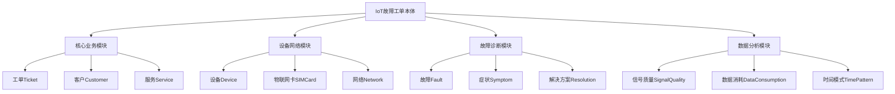

# 物联网故障工单本体：概览与入门

版本：1.0.0  
发布日期：2025-01-08  
作者：亚信科技 AI 研究院  
命名空间：`http://www.asiainfo.com/ontology/iot-fault-ticket#`  
前缀：`iotft:`

## 1. 引言与背景

### 1.1 设计背景

在物联网（IoT）运营商业务中，每天产生数以万计的故障工单。这些工单涉及复杂的网络架构、多样化的终端设备、以及错综复杂的故障现象。传统的非结构化文本记录方式存在以下挑战：

- **知识孤岛**：故障经验分散在各个系统中，难以形成知识积累
- **诊断效率低**：相似问题重复出现，缺乏智能化诊断支持
- **数据不一致**：不同系统对同一概念的描述各异，影响数据交换
- **分析困难**：海量工单数据难以进行深度分析和模式挖掘

### 1.2 本体价值

物联网故障工单本体（IoT Fault Ticket Ontology）通过提供标准化的概念模型和语义描述，实现：

1. **知识标准化**：统一故障工单的概念定义和关系描述
2. **智能化诊断**：支持基于语义推理的故障原因分析
3. **经验复用**：构建可重用的故障解决方案知识库
4. **数据互操作**：促进不同系统间的数据交换和集成

## 2. 适用范围

### 2.1 领域覆盖

本体涵盖物联网运营商故障处理的完整生命周期：

- **核心业务领域**：工单管理、客户服务、SLA保障
- **设备网络领域**：物联网卡、终端设备、网络配置
- **故障诊断领域**：故障分类、症状分析、根因定位
- **数据分析领域**：信号质量、流量消耗、时间模式

### 2.2 目标用户

- **运营商技术人员**：故障诊断、网络优化
- **客服支持团队**：工单处理、客户沟通
- **系统开发者**：构建智能化故障处理系统
- **数据分析师**：故障模式分析、预测性维护

## 3. 设计理念

### 3.1 核心原则

1. **业务驱动**：基于真实故障工单场景设计
2. **可扩展性**：支持新设备类型和故障类型的扩展
3. **标准兼容**：与国际标准本体（如FOAF、SKOS）对齐
4. **实用性**：平衡语义完整性与实施复杂度

### 3.2 模块化设计

本体采用模块化架构，分为四大模块：



## 4. 主要用例

### 4.1 场景一：地下停车场充电桩频繁离线

**业务背景**：某物业公司在地下停车场部署了50个智能充电桩，使用物联网卡进行远程管理。近期出现多个充电桩频繁离线的问题。

**本体应用**：

```turtle
@prefix iotft: <http://www.asiainfo.com/ontology/iot-fault-ticket#> .
@prefix ex: <http://example.org/fault-ticket/> .

# 故障工单实例
ex:ticket_001 a iotft:Ticket ;
    iotft:hasId "JT-XXX-XXXXXX-XXXXXX-X-XXXX" ;
    iotft:hasStatus iotft:InProgress ;
    iotft:hasPriority iotft:High ;
    iotft:describes ex:fault_001 ;
    iotft:reportedBy ex:customer_001 .

# 故障描述
ex:fault_001 a iotft:NetworkFault ;
    iotft:hasType iotft:FrequentOffline ;
    iotft:hasSymptom [
        a iotft:Symptom ;
        iotft:symptomType iotft:NoConnection ;
        iotft:frequency "每天3-5次" ;
        iotft:severity iotft:High
    ] ;
    iotft:occurredAt [
        a iotft:Location ;
        iotft:locationType iotft:Underground ;
        iotft:address "某市某区某小区地下停车场"
    ] ;
    iotft:hasRootCause [
        a iotft:RootCause ;
        iotft:causeType iotft:SignalCoverage ;
        iotft:confidence 0.85 ;
        iotft:evidence "地下环境信号衰减严重"
    ] .

# 设备信息
ex:device_001 a iotft:Device ;
    iotft:deviceType iotft:ChargingStation ;
    iotft:uses ex:sim_001 ;
    iotft:experiences ex:fault_001 .

# 解决方案
ex:resolution_001 a iotft:Resolution ;
    iotft:resolutionType iotft:NetworkOptimization ;
    iotft:action "部署室内信号增强设备" ;
    iotft:successRate 0.92 .
```

### 4.2 场景二：批量物联网卡异常流量分析

**业务背景**：某共享单车企业发现部分区域的车辆物联网卡流量异常增长，需要快速定位原因并采取措施。

**本体应用**：

```turtle
# 批量故障模式
ex:bulk_fault_001 a iotft:BulkFaultPattern ;
    iotft:patternId "BF-XXXXXXXX-001" ;
    iotft:affectedScale iotft:Large ;  # 影响1000-10000张卡
    iotft:triggerCause iotft:ConfigChange ;
    iotft:geographicPattern iotft:Regional ;
    iotft:relatedFaults ex:fault_002, ex:fault_003, ex:fault_004 .

# 数据消耗异常
ex:consumption_001 a iotft:DataConsumption ;
    iotft:monitoringPeriod [
        iotft:startDate "2025-03-01"^^xsd:date ;
        iotft:endDate "2025-03-06"^^xsd:date
    ] ;
    iotft:totalUsage [
        iotft:value 500 ;
        iotft:unit iotft:GB
    ] ;
    iotft:anomalyType iotft:TrafficSpike ;
    iotft:usagePattern [
        a iotft:UsagePattern ;
        iotft:anomalyScore 0.95 ;
        iotft:topDomains "update.vendor.com", "log.analytics.com"
    ] .
```

### 4.3 场景三：2G网络退网影响评估

**业务背景**：运营商计划进行2G网络退网，需要评估对存量物联网设备的影响并制定迁移方案。

**本体应用**：

```turtle
# 2G退网故障
ex:fault_2g_sunset a iotft:NetworkFault ;
    iotft:hasSubtype iotft:2GNetworkSunset ;
    iotft:affectedDevices [
        a iotft:DeviceGroup ;
        iotft:deviceTypes iotft:SmartMeter, iotft:GPS ;
        iotft:totalCount 50000 ;
        iotft:networkCapability iotft:2GOnly
    ] ;
    iotft:migrationPlan [
        a iotft:MigrationStrategy ;
        iotft:targetNetwork iotft:NBIoT ;
        iotft:timelineMonths 6 ;
        iotft:costEstimate "500万元"
    ] .
```

## 5. 文档导航

本体文档集包含以下内容：

### 5.1 人类可读文档

1. **概览与入门**（本文档）
   - 背景介绍、设计理念、使用场景

2. **[核心词汇与模型规范](./IOT-Fault-Ticket-Ontology-Vocabulary-CN.md)**
   - 详细的类、属性、关系定义
   - 语义约束和使用规则

3. **[约束与验证规则](./IOT-Fault-Ticket-Ontology-Constraints-CN.md)**（计划中）
   - SHACL形状定义
   - 数据质量验证规则

### 5.2 机器可读文件

1. **[本体定义文件](./iot-fault-ticket-ontology.ttl)**
   - Turtle格式的完整本体定义

2. **[SHACL约束文件](./iot-fault-ticket-shapes.ttl)**（计划中）
   - 数据验证规则

## 6. 快速上手

### 6.1 环境准备

```bash
# 安装Apache Jena（用于本体处理）
wget https://dlcdn.apache.org/jena/binaries/apache-jena-4.9.0.tar.gz
tar -xzf apache-jena-4.9.0.tar.gz

# 验证本体文件
./apache-jena-4.9.0/bin/riot --validate iot-fault-ticket-ontology.ttl
```

### 6.2 基础查询示例

```sparql
PREFIX iotft: <http://www.asiainfo.com/ontology/iot-fault-ticket#>

# 查询所有高优先级的网络故障工单
SELECT ?ticket ?fault ?rootCause
WHERE {
    ?ticket a iotft:Ticket ;
            iotft:hasPriority iotft:High ;
            iotft:describes ?fault .
    ?fault a iotft:NetworkFault ;
           iotft:hasRootCause ?rootCause .
}
```

### 6.3 Python集成示例

```python
from rdflib import Graph, Namespace, URIRef, Literal

# 创建图并加载本体
g = Graph()
g.parse("iot-fault-ticket-ontology.ttl", format="turtle")

# 定义命名空间
IOTFT = Namespace("http://www.asiainfo.com/ontology/iot-fault-ticket#")

# 创建新的工单实例
ticket = URIRef("http://example.org/ticket/12345")
g.add((ticket, RDF.type, IOTFT.Ticket))
g.add((ticket, IOTFT.hasId, Literal("TK-20250306-001")))
g.add((ticket, IOTFT.hasStatus, IOTFT.Open))

# 保存结果
g.serialize("my-fault-tickets.ttl", format="turtle")
```

## 7. 社区与贡献

### 7.1 获取帮助

- **GitHub仓库**：[https://github.com/asiainfo/iot-fault-ticket-ontology](https://github.com/asiainfo/iot-fault-ticket-ontology)
- **问题反馈**：通过GitHub Issues提交
- **邮件列表**：iot-ontology@example.com

### 7.2 参与贡献

我们欢迎社区贡献，包括：

- 新增故障类型和设备类型
- 改进文档和示例
- 提供不同语言的实现示例
- 分享使用案例

详细贡献指南请参见[CONTRIBUTING.md](./CONTRIBUTING.md)。

## 8. 版权与许可

本体采用 Apache License 2.0 开源协议发布。

---

**下一步**：阅读[核心词汇与模型规范](./IOT-Fault-Ticket-Ontology-Vocabulary-CN.md)了解详细的本体定义。
