# 网络资源管理本体：概览与入门

版本：1.0.0

发布日期：2025-10-31

作者：亚信科技 AI 研究院

命名空间：`http://www.asiainfo.com/Ontology/Resource-Manage#`

前缀：`resmg:`

## 1. 引言与背景

### 1.1 设计背景

在网络技术飞速发展的当下，网络资源的规模持续扩大，种类日益丰富，这使得网络资源管理面临着诸多挑战，如数据孤岛、语义不统一、动态关联缺失等。Ontology（本体）技术凭借其在知识表示、语义描述和关系定义方面的优势，为解决这些问题提供了全新的思路。本文将结合相关文档，深入探索 Ontology 在网络资源管理中的应用技术路径，包括本体构建、模型转换、自动化生成、与大模型集成以及实际应用场景等方面，并辅以图文说明，为网络资源管理的智能化发展提供参考。

- **数据孤岛**：资源数据分散在设备管理系统、客户业务系统、地址管理系统中，缺乏统一关联，跨系统协同效率低
- **语义混乱**：同一资源在不同系统中属性命名不一致，导致数据整合困难
- **拓扑割裂**：网络设备间的连接关系以静态表格存储，无法动态推导故障影响范围
- **运维低效**：业务开通预校验、故障根因定位依赖人工经验，缺乏基于语义的自动化推理支持

### 1.2 本体价值

网络资源管理本体（Resource Manage Ontology）通过标准化的概念模型、语义关系定义，实现网络资源全生命周期的智能化管理，核心价值包括：

1. **知识标准化**：统一家客场景、传输内线等领域的资源概念
2. **运维智能化**：基于本体推理自动推导资源关联关系，支持故障影响范围定位、业务开通预校验，减少人工干预
3. **资源协同化**：打破系统数据壁垒，实现设备资源、客户资源、地址资源的跨域关联，提升资源调度效率
4. **分析深度化**：基于语义化数据开展资源利用率分析、业务承载能力评估，为网络规划提供数据支撑

## 2. 适用范围

### 2.1 领域覆盖

本体覆盖运营商网络资源管理的全业务场景，核心领域包括：

- **核心业务领域**：资源管理、数据治理、业务开通
- **设备网络领域**：网络配置、设备割接、容量规划
- **故障诊断领域**：故障监控、影响推导、根因定位
- **数据分析领域**：聚类分析、成本核算、规划优化

### 2.2 目标用户

- **网络运维人员**：故障定位、设备状态监控、资源拓扑梳理
- **业务支撑人员**：宽带 / IPTV 业务开通预校验、客户资源关联查询
- **系统开发者**：构建智能化网络资源管理平台、跨系统数据集成
- **网络规划人员**：资源覆盖评估、设备扩容需求分析

## 3. 设计理念

### 3.1 核心原则

1. **业务对齐**：基于运营商家客资源管理实际场景设计，覆盖 “客户 - 业务 - 设备 - 区域” 全链路
2. **可扩展性**：支持新增设备类型、业务类型的属性与关系扩展
3. **标准兼容**：采用 OWL（Web Ontology Language）规范构建，属性定义参考 RDF Schema 标准，确保与主流语义处理工具（如 Apache Jena）兼容
4. **实用性优先**：平衡语义完整性与实施复杂度，核心资源（如 OLT、Customer）细化属性与关系，辅助资源（如 POI、Room）保留基础定义，降低落地成本

### 3.2 模块化设计

本体采用模块化架构，按核心业务域分为四大模块，模块间通过语义关系关联：

```mermaid
graph TB
    A[RM网络资源本体] --> B[空间类型]
    A --> C[家客类型]
    A --> D[业务场景覆盖类型]
    A --> E[传输内线类型]
    
    B --> B1[区域District]
    B --> B2[站点Site]
    B --> B3[机房Room]
    B --> B4[位置点Poi]
    B --> B5[标准地址Address]
    
    C --> C1[小区信息Community]
    C --> C2[家庭客户实例Customer]
    C --> C3[宽带业务信息BroadbandService]
    C --> C4[IMS业务信息IMSService]
    C --> C5[互联网电视业务信息IPTVService]
    C --> C6[家客小区网格MarketGrid]
    C --> C7[机顶盒OttDevice]
    
    D --> D1[ONU设备ONU]
    D --> D2[ONU端口ONUPort]
    D --> D3[分光器POS]
    D --> D4[分光器端口ONUPort]
    D --> D5[多媒体箱MultimediaBox]
    D --> D6[分纤箱FiberTTBox]
    D --> D7[分纤箱端子FiberTTBoxPort]
    D --> D8[业务场景PON覆盖PONCoverage]
    D --> D9[覆盖资源合集CoverageCollection]

    E --> E1[OLT设备OLT]
    E --> E2[OLT板卡OltCard]
    E --> E3[OLT端口OLTPort]
```



## 4. 主要用例

### 4.1 场景一：家庭宽带业务开通预校验

在客户申请宽带等业务时，利用本体对业务路径进行预校验。通过本体验证路径的承载能力，如带宽是否满足要求、延迟是否在合理范围内等，自动反馈业务开通的可行性，缩短业务开通周期。

**业务背景**：某用户申请 1000M 宽带业务，需校验其所在地址是否有可用 ONU 端口、OLT 带宽是否满足需求。

**本体应用**：

```turtle
@prefix resmg: <http://www.asiainfo.com/Ontology/Resource-Manage#> .
@prefix ex: <http://example.org/Resource-Manage/example#> .

# 1. 申请业务的客户
ex:Customer_002 a resmg:Customer ;
    resmg:hasCustomerCode "CUST-SH-002-2025" ;
    resmg:hasCustomerType "家庭用户" ;
    resmg:hasProductType "待开通宽带" ;
    resmg:hasAccessAddress ex:Address_002 ;  # 申请地址
    resmg:belongsToCommunity ex:Community_002 .  # 所属小区

# 2. 客户申请地址及PON覆盖校验
ex:Address_002 a resmg:Address ;
    resmg:hasResourceId "ADDR-SH-002-2025" ;
    resmg:hasAddressLevel "单元" ;
    resmg:hasCurrentName "2单元" ;
    resmg:hasFullName "上海市浦东新区YY小区2号楼2单元" ;
    resmg:belongsToDistrict ex:District_SH_Pudong ;
    resmg:hasParentAddress ex:Address_Building_02 .  # 上级地址：2号楼

ex:PONCoverage_002 a resmg:PONCoverage ;
    resmg:hasResourceId "PON-SH-002-2025" ;
    resmg:hasCoverageType "商住楼宇" ;
    resmg:hasResourceCoverage "到单元" ;
    resmg:hasIsShare "否" ;
    resmg:hasPonCoverageType "FTTH" ;
    resmg:coversAddress ex:Address_002 ;  # 覆盖客户地址
    resmg:includesCollection ex:CoverageCollection_002 ;  # 包含资源合集
    resmg:belongsToDistrict ex:District_SH_Pudong .

# 3. 资源合集及分光器端口校验
ex:CoverageCollection_002 a resmg:CoverageCollection ;
    resmg:hasResourceId "COLL-SH-002-2025" ;
    resmg:hasPonCoverageResourceType "分光器+分纤箱" ;
    resmg:containsPOS ex:POS_002 ;  # 包含分光器
    resmg:containsFiberTTBox ex:FiberTTBox_002 .  # 包含分纤箱

ex:POS_002 a resmg:POS ;
    resmg:hasResourceId "POS-SH-002-2025" ;
    resmg:hasLifeState "正常" ;
    resmg:hasSplitterRatio "1:64" ;
    resmg:hasPosPort ex:POSPort_002_01 .  # 关联分光器端口

ex:POSPort_002_01 a resmg:POSPort ;
    resmg:hasResourceId "POSPort-SH-002-01-2025" ;
    resmg:hasPosPortNo "15" ;
    resmg:hasPosPortState "空闲" ;  # 端口状态为空闲，满足开通需求
    resmg:belongsToPOS ex:POS_002 ;  # 归属分光器
    resmg:belongsToDistrict ex:District_SH_Pudong .

# 4. 业务预开通记录
ex:BroadbandService_002 a resmg:BroadbandService ;
    resmg:hasBroadbandProductId "BBS-SH-002-2025" ;
    resmg:hasBroadbandProductAccount "021-87654321" ;
    resmg:hasBroadbandAccessType "FTTH" ;
    resmg:hasBizState "待开通" ;
    resmg:hasBandRate "1000M" ;
    resmg:hasIsBusinessBroadband "否" ;
    resmg:isOwnedByCustomer ex:Customer_002 ;  # 归属客户
    resmg:preCheckResult "通过" ;  # 预校验结果：地址覆盖+端口空闲
    resmg:preCheckPort ex:POSPort_002_01 .  # 预占用端口
```

### 4.2 场景二：家客故障影响范围分析

基于网络资源本体，当设备发生告警时，系统可以自动推导故障的影响范围。通过本体中定义的实体关系，如设备与ONU、POS、OLT之间的连接关系，快速定位故障可能影响的业务和客户，生成修复工单，提高故障处理效率。

**业务背景**：某小区 ONU 设备离线，需自动定位受影响的客户与业务。

**本体应用**：

```turtle
@prefix resmg: <http://www.asiainfo.com/Ontology/Resource-Manage#> .
@prefix ex: <http://example.org/Resource-Manage/example#> .

# 1. 故障ONU设备实例
ex:ONU_001 a resmg:ONU ;
    resmg:hasResourceId "ONU-SH-001-2025" ;
    resmg:hasLifeState "故障" ;
    resmg:hasVendor "华为" ;
    resmg:hasOnuSubclass "HGU" ;
    resmg:hasOnuAccessType "FTTH" ;
    resmg:belongsToDistrict ex:District_SH_Pudong ;  # 所属区县：上海浦东
    resmg:installedInMultimediaBox ex:MultimediaBox_01 ;  # 安装于多媒体箱
    resmg:isConnectedToPOS ex:POS_001 ;  # 上联分光器
    resmg:isConnectedToOLT_ONU ex:OLT_001 .  # 上联OLT

# 2. 关联的分光器与OLT
ex:POS_001 a resmg:POS ;
    resmg:hasResourceId "POS-SH-001-2025" ;
    resmg:hasLifeState "正常" ;
    resmg:hasSplitterRatio "1:32" ;
    resmg:hasPosLevel "一级分光" ;
    resmg:installedInFiberTTBox ex:FiberTTBox_01 ;  # 安装于分纤箱
    resmg:isConnectedToOLTPort_POS ex:OLTPort_001 .  # 上联OLT端口

ex:OLTPort_001 a resmg:OLTPort ;
    resmg:hasResourceId "OLTPort-SH-001-2025" ;
    resmg:hasOltPortState "占用" ;
    resmg:hasOltPortPhysicsType "光口" ;
    resmg:belongsToOLTCard ex:OLTCard_001 ;  # 归属OLT板卡
    resmg:oltPortBelongsToOLT ex:OLT_001 .  # 归属OLT

# 3. 故障影响的客户与业务
ex:Customer_001 a resmg:Customer ;
    resmg:hasCustomerCode "CUST-SH-001-2025" ;
    resmg:hasCustomerType "家庭用户" ;
    resmg:hasProductType "宽带+IPTV" ;
    resmg:belongsToCommunity ex:Community_001 ;  # 所属小区
    resmg:hasAccessAddress ex:Address_001 .  # 关联标准地址

ex:BroadbandService_001 a resmg:BroadbandService ;
    resmg:hasBroadbandProductId "BBS-SH-001-2025" ;
    resmg:hasBroadbandProductAccount "021-12345678" ;
    resmg:hasBroadbandAccessType "FTTH" ;
    resmg:hasBizState "已开通" ;
    resmg:hasBandRate "1000M" ;
    resmg:hasIsBusinessBroadband "否" ;
    resmg:isOwnedByCustomer ex:Customer_001 ;  # 归属客户
    resmg:broadbandBelongsToONU ex:ONU_001 .  # 所属ONU

# 4. 关联的空间资源
ex:Address_001 a resmg:Address ;
    resmg:hasResourceId "ADDR-SH-001-2025" ;
    resmg:hasAddressLevel "楼栋" ;
    resmg:hasCurrentName "1号楼" ;
    resmg:hasFullName "上海市浦东新区XX小区1号楼" ;
    resmg:hasParentAddress ex:Address_Community ;  # 上级地址：小区
    resmg:belongsToDistrict ex:District_SH_Pudong .  # 所属区县

ex:Community_001 a resmg:Community ;
    resmg:hasResourceId "COMM-SH-001-2025" ;
    resmg:hasCommunityName "XX小区" ;
    resmg:hasZoneType "城市" ;
    resmg:hasAddressReference ex:Address_001 ;  # 关联标准地址
    resmg:belongsToDistrict ex:District_SH_Pudong ;  # 所属区县
    resmg:belongsToMarketGrid ex:MarketGrid_001 .  # 所属家客网格
```

## 5. 文档导航

本体文档集包含人类可读文档与机器可读文件，便于开发与运维使用：

### 5.1 人类可读文档

1. **概览与入门**（本文档）
   - 背景介绍、设计理念、核心用例
   - 目标用户与适用场景说明
2. **[核心词汇与模型规范](./Resource-Manage-Ontology-Vocabulary-CN.md)**
   - 详细类（Class）、对象属性（Object Property）、数据属性（Data Property）定义
   - 语义约束（如 cardinality 限制）与使用规则
3. **[约束与验证规则](./Resource-Manage-Ontology-Constraints-CN.md)**（计划中）
   - SHACL 形状定义（如业务开通预校验规则）
   - 数据质量验证规则（如必填属性检查）

### 5.2 机器可读文件

1. **[本体定义文件](./Resource-Manage-ontopology.ttl)**
   - Turtle 格式的完整本体定义，可直接导入 Jena、Protégé 等工具
   - 包含类、属性、关系及实例的标准化描述
2. **[SHACL 约束文件](./Resource-Manage-ontopology-Constraints-CN.md)**（计划中）
   - 基于 SHACL 的资源数据验证规则，支持自动化校验

## 6. 快速上手

### 6.1 环境准备

```bash
# 1. 安装Apache Jena（用于本体解析与查询） java8版本使用3.17.0 如需使用jena4以上版本，则需java11以上版本
wget https://dlcdn.apache.org/jena/binaries/apache-jena-3.17.0.tar.gz
tar -xzf apache-jena-3.17.0.tar.gz

# 2. 验证本体文件完整性
./apache-jena-3.17.0/bin/riot --validate Resource-Manage-ontopology.ttl

# 3. 启动Fuseki服务（用于SPARQL查询）
./apache-jena-3.17.0/fuseki-server --update --mem /netres
```

### 6.2 基础查询示例

#### 示例 1：查询某区县下所有状态为‘空闲’的 OLT 端口

```sparql
PREFIX resmg: <http://www.asiainfo.com/ontology/Resource-Manage#>

SELECT ?oltPortId ?oltPortName ?oltName ?districtName
WHERE {
    # 筛选OLT端口，状态为“空闲”
    ?oltPort a resmg:OLTPort ;
             resmg:hasResourceId ?oltPortId ;
             resmg:hasOltPortName ?oltPortName ;
             resmg:hasOltPortState "空闲" ;
             resmg:oltPortBelongsToOLT ?olt ;  # 关联OLT
             resmg:belongsToDistrict ?district .  # 关联区县
    
    # 筛选OLT信息
    ?olt a resmg:OLT ;
         resmg:hasOltName ?oltName .
    
    # 筛选区县为“上海市浦东新区”
    ?district a resmg:District ;
              resmg:hasDistrictName ?districtName ;
              resmg:hasDistrictType "区县" ;
              resmg:hasDistrictName "上海市浦东新区" .
}
```

#### 示例 2：查询受某 ONU 故障影响的客户

```sparql
PREFIX netres: <http://www.asiainfo.com/ontology/Resource-Manage#>
PREFIX xsd: <http://www.w3.org/2001/XMLSchema#>

SELECT ?customerCode ?customerName ?affectedService
WHERE {
    # 故障ONU标识
    ?faultOnu a netres:ONU ;
              netres:hasResourceId "ONU-2025-00002"^^xsd:string ;
              netres:experiences netres:DeviceOffline ;
              netres:belongsToCustomer ?customer .
    
    # 关联客户信息
    ?customer netres:hasCustomerCode ?customerCode ;
              netres:hasCustomerName ?customerName ;
              netres:ownsService ?service .
    
    # 关联受影响业务
    ?service netres:serviceStatus netres:Interrupted ;
             netres:hasServiceName ?affectedService .
}
```

### 6.3 Python 集成示例

```python

from rdflib import Graph, Namespace, URIRef, Literal, RDF

# 1. 初始化图与命名空间
g = Graph()
resmg = Namespace("http://www.asiainfo.com/Ontology/Resource-Manage#")
g.bind("resmg", resmg)

# 2. 加载本体定义
g.parse("./Resource-Manage-ontopology.ttl", format="turtle")

# 3. 创建标准地址实例
ex = "http://www.asiainfo.com/Ontology/Resource-Manage#"
address = URIRef(ex + "Address")
g.add((address, RDF.type, resmg.Address))
g.add((address, resmg.hasResourceId, Literal("ADDR-SH-003-2025")))
g.add((address, resmg.hasAddressLevel, Literal("楼层")))
g.add((address, resmg.hasCurrentName, Literal("3层")))
g.add((address, resmg.hasFullName, Literal("上海市浦东新区ZZ小区3号楼3层")))
g.add((address, resmg.belongsToDistrict, URIRef(ex + "District_SH_Pudong")))

# 4. 创建家庭客户实例，关联地址
customer = URIRef(ex + "Customer")
g.add((customer, RDF.type, resmg.Customer))
g.add((customer, resmg.hasCustomerCode, Literal("CUST-SH-003-2025")))
g.add((customer, resmg.hasCustomerType, Literal("家庭用户")))
g.add((customer, resmg.hasProductType, Literal("宽带")))
g.add((customer, resmg.hasAccessAddress, address))  # 关联地址
g.add((customer, resmg.belongsToCommunity, URIRef(ex + "Community")))

# 5. 保存实例数据到文件
g.serialize("./new-resource-instances.ttl", format="turtle")
print("新增资源实例已保存至 new-resource-instances.ttl")
```

## 7. 社区与贡献

### 7.1 获取帮助

- **GitHub 仓库**：https://github.com/asiainfo/Resource-Manage-ontology
- **问题反馈**：通过 GitHub Issues 提交本体使用问题或功能建议
- **邮件列表**：Resource-Manage-ontology@asiainfo.com

### 7.2 参与贡献

我们欢迎社区成员参与本体优化，贡献方向包括：

- 新增资源类型（如 5G 家客边缘设备、智慧家庭终端）
- 补充属性与关系（如设备能耗属性、业务 QoS 关联关系）
- 完善文档与示例（如新增政企客户资源用例、设备故障自愈用例）
- 优化验证规则（如新增资源拓扑完整性校验、业务属性一致性校验）

详细贡献指南请参见[CONTRIBUTING.md](./CONTRIBUTING.md)。

## 8. 版权与许可

本体采用 **Apache License 2.0** 开源协议发布，允许商业使用、修改与分发，需保留原版权声明。

------

**下一步**：阅读[核心词汇与模型规范](./Resource-Manage-Ontology-Vocabulary-CN.md)，深入了解本体的类、属性及约束定义。