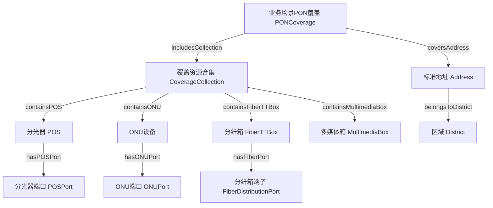

# 网络资源管理本体：核心词汇与模型规范

版本：1.0

发布日期：2025-01-08

命名空间：`http://www.asiainfo.com/Ontology/Resource-Manage#`

前缀：`network:`

## 目录

1. [命名空间与前缀](https://www.doubao.com/chat/24625027886270978#1-命名空间与前缀)
2. [类层次结构](https://www.doubao.com/chat/24625027886270978#2-类层次结构)
3. [核心类定义](https://www.doubao.com/chat/24625027886270978#3-核心类定义)
4. [属性定义](https://www.doubao.com/chat/24625027886270978#4-属性定义)
5. [核心模型图](https://www.doubao.com/chat/24625027886270978#5-核心模型图)
6. [使用示例](https://www.doubao.com/chat/24625027886270978#6-使用示例)
7. [数据验证规则](https://www.doubao.com/chat/24625027886270978#7-数据验证规则)
8. [版本管理](https://www.doubao.com/chat/24625027886270978#8-版本管理)
9. [参考资料](https://www.doubao.com/chat/24625027886270978#9-参考资料)

## 1. 命名空间与前缀

### 1.1 本体命名空间

```turtle
@prefix network: <http://www.asiainfo.com/ontology/Resource-Manage#> .
@base <http://www.asiainfo.com/ontology/Resource-Manage#> .
```

### 1.2 外部依赖命名空间

```turtle
@prefix rdf: <http://www.w3.org/1999/02/22-rdf-syntax-ns#> .
@prefix rdfs: <http://www.w3.org/2000/01/rdf-schema#> .
@prefix owl: <http://www.w3.org/2002/07/owl#> .
@prefix xsd: <http://www.w3.org/2001/XMLSchema#> .
@prefix foaf: <http://xmlns.com/foaf/0.1/> .
@prefix skos: <http://www.w3.org/2004/02/skos/core#> .
@prefix dcterms: <http://purl.org/dc/terms/> .
@prefix vcard: <http://www.w3.org/2006/vcard/ns#> .
```

### 1.3 版本信息

```turtle
<http://www.asiainfo.com/ontology/Resource-Manage#> 
    a owl:Ontology ;
    owl:versionInfo "1.0" ;
    dcterms:title "网络资源管理本体"@zh-CN ;
    dcterms:title "Resource Management Ontology"@en ;
    dcterms:description "基于家客场景网络资源模型构建的完整本体，覆盖地址、设备、业务、区域等实体及关联关系，支持网络资源查询、调度与故障定位"@zh-CN ;
    dcterms:creator "亚信科技 AI 研究院" ;
    dcterms:created "2025-01-08"^^xsd:date ;
    dcterms:license <http://www.apache.org/licenses/LICENSE-2.0> ;
```

## 2. 类层次结构

### 2.1 顶层类架构

```plaintext
owl:Thing
├── network:Space                # 空间类型（父类）
│   ├── network:Address          # 标准地址
│   ├── network:District         # 区域（省/市/区县）
│   ├── network:POI              # 位置点
│   ├── network:Room             # 机房
│   └── network:Site             # 站点
├── network:HomeCustomer         # 家客类型（父类）
│   ├── network:BroadbandService # 宽带业务信息
│   ├── network:Community        # 小区信息
│   ├── network:Customer         # 家庭客户实例
│   ├── network:IMSService       # IMS业务信息
│   ├── network:IPTVService      # 互联网电视业务信息
│   ├── network:MarketGrid       # 家客小区网格
│   └── network:OTTDevice        # 机顶盒
├── network:ServiceSceneCoverage # 业务场景覆盖类型（父类）
│   ├── network:CoverageCollection # 覆盖资源合集
│   ├── network:FiberDistributionPort # 分纤箱端子
│   ├── network:FiberTTBox       # 分纤箱
│   ├── network:MultimediaBox    # 多媒体箱
│   ├── network:ONU              # ONU设备
│   ├── network:ONUPort          # ONU端口
│   ├── network:PONCoverage      # 业务场景PON覆盖
│   ├── network:POS              # 分光器
│   └── network:POSPort          # 分光器端口
└── network:TransmissionInnerLine # 传输内线类型（父类）
    ├── network:OLT              # OLT设备
    ├── network:OLTCard          # OLT板卡
    └── network:OLTPort          # OLT端口
```

### 2.2 类间约束关系

| 父类                  | 子类列表                                                     | 核心关联场景             |
| --------------------- | ------------------------------------------------------------ | ------------------------ |
| network:Space         | Address、District、POI、Room、Site                           | 空间资源定位与层级管理   |
| network:HomeCustomer  | BroadbandService、Community、Customer、IMSService、IPTVService、MarketGrid、OTTDevice | 家客业务与客户关联       |
| ServiceSceneCoverage  | CoverageCollection、FiberDistributionPort、FiberTTBox、MultimediaBox、ONU、ONUPort、PONCoverage、POS、POSPort | 网络设备部署与业务覆盖   |
| TransmissionInnerLine | OLT、OLTCard、OLTPort                                        | 传输网络核心设备层级关系 |

## 3. 核心类定义

### 3.1 空间类（Space）及子类

#### 3.1.1 区域类（District）

```turtle
network:District a owl:Class ;
    rdfs:subClassOf network:Space ;
    rdfs:label "区域（省/市/区县）"@zh-CN ;
    rdfs:label "District (Province/City/County)"@en ;
    rdfs:comment "对应家客场景中'省份'、'地市'、'区县'，包含区域层级关系，用于资源的地理归属划分"@zh-CN ;
    rdfs:subClassOf [
        a owl:Restriction ;
        owl:onProperty network:hasDistrictName ;
        owl:cardinality "1"^^xsd:nonNegativeInteger
    ] ;
    rdfs:subClassOf [
        a owl:Restriction ;
        owl:onProperty network:hasDistrictType ;
        owl:cardinality "1"^^xsd:nonNegativeInteger ;
        owl:onDataRange [
            a rdfs:Datatype ;
            owl:oneOf ( "省份" "地市" "区县" )
        ]
    ] .
```

**属性约束**：

- `hasDistrictName`: 必填，区域名称
- `hasDistrictType`: 必填，区域类型，枚举值：省份 / 地市 / 区县
- `hasParentDistrict`: 必填，关联上级区域（如 “区县→地市”“地市→省份”）

#### 3.1.2 标准地址类（Address）

```turtle
network:Address a owl:Class ;
    rdfs:subClassOf network:Space ;
    rdfs:label "标准地址"@zh-CN ;
	rdfs:label "Standard Address"@en ;
    rdfs:comment "家客场景中的分级地址（如省→市→区→街道→楼栋→单元→房间），关联所属区县，支持客户与设备的精准定位"@zh-CN ;
    rdfs:subClassOf [
        a owl:Restriction ;
        owl:onProperty network:hasFullName ;
        owl:cardinality "1"^^xsd:nonNegativeInteger
    ] ;
    rdfs:subClassOf [
        a owl:Restriction ;
        owl:onProperty network:belongsToDistrict ;
        owl:cardinality "1"^^xsd:nonNegativeInteger ;
        owl:onClass network:District
    ] .
```

**属性约束**：

- `hasAddressLevel`: 必填，地址级别
- `hasCurrentName`: 必填，地址分段名称
- `hasFullName`: 必填，地址完整名称
- `belongsToDistrict`: 必填，所属区县

### 3.2 家客类（HomeCustomer）及子类

#### 3.2.1 家庭客户类（Customer）

```turtle
network:Customer a owl:Class ;
    rdfs:subClassOf network:HomeCustomer ;
    rdfs:label "家庭客户实例"@zh-CN ;
    rdfs:label "Home Customer Instance"@en ;
    rdfs:comment "家客场景中的家庭客户主体，关联标准地址、小区及开通的业务（宽带/IMS/IPTV）"@zh-CN ;
    rdfs:subClassOf [
        a owl:Restriction ;
        owl:onProperty network:hasCustomerCode ;
        owl:cardinality "1"^^xsd:nonNegativeInteger
    ] ;
    rdfs:subClassOf [
        a owl:Restriction ;
        owl:onProperty network:hasAccessAddress ;
        owl:cardinality "1"^^xsd:nonNegativeInteger ;
        owl:onClass network:Address
    ] .
```

**属性约束**：

- `hasCustomerCode`: 必填，客户唯一标识
- `hasCustomerType`: 必填，客户类型
- `hasProductType`: 必填，客户产品类型
- `hasAccessAddress`: 必填，关联标准地址
- `belongsToCommunity`: 必填，所属小区
- `belongsToDistrict`: 必填，所属区县

#### 3.2.2 宽带业务类（BroadbandService）

```turtle
network:BroadbandService a owl:Class ;
    rdfs:subClassOf network:HomeCustomer ;
    rdfs:label "宽带业务信息"@zh-CN ;
	rdfs:label "Broadband Service Info"@en ;
    rdfs:comment "客户开通的宽带业务实例，包含产品标识、带宽速率、接入方式等信息，关联归属客户与ONU设备"@zh-CN ;
    rdfs:subClassOf [
        a owl:Restriction ;
        owl:onProperty network:hasBroadbandProductId ;
        owl:cardinality "1"^^xsd:nonNegativeInteger
    ] ;
    rdfs:subClassOf [
        a owl:Restriction ;
        owl:onProperty network:isOwnedByCustomer ;
        owl:cardinality "1"^^xsd:nonNegativeInteger ;
        owl:onClass network:Customer
    ] ;
    rdfs:subClassOf [
        a owl:Restriction ;
        owl:onProperty network:broadbandBelongsToONU ;
        owl:cardinality "1"^^xsd:nonNegativeInteger ;
        owl:onClass network:ONU
    ] .
```

**属性约束**：

- `hasBroadbandProductId`: 必填，宽带产品实例标识
- `hasBroadbandProductAccount`: 必填，业务账号
- `hasBroadbandAccessType`: 必填，宽带接入方式，枚举值：FTTB、FTTH等
- `hasBizState`: 必填，客户业务状态，枚举值：已开通、已拆除、工程等
- `hasBandRate`: 必填，带宽速率，枚举值：1000M、500M等
- `hasIsBusinessBroadband`: 必填，是否企宽用户，枚举值：是、否
- `broadbandBelongsToONU`: 必填，宽带业务所属ONU
- `isOwnedByCustomer`: 必填，归属客户
- `belongsToDistrict`: 必填，所属区县

### 3.3 业务场景覆盖类（ServiceSceneCoverage）及子类

#### 3.3.1 ONU 设备类（ONU）

```turtle
network:ONU a owl:Class ;
    rdfs:subClassOf network:ServiceSceneCoverage ;
    rdfs:label "ONU设备"@zh-CN ;
	rdfs:label "ONU Device"@en ;
    rdfs:comment "家客场景中的光网络单元，关联分光器、OLT设备及多媒体箱，是宽带业务的终端接入节点"@zh-CN ;
    rdfs:subClassOf [
        a owl:Restriction ;
        owl:onProperty network:hasOnuName ;
        owl:cardinality "1"^^xsd:nonNegativeInteger
    ] ;
    rdfs:subClassOf [
        a owl:Restriction ;
        owl:onProperty network:hasAuthCode ;
        owl:cardinality "1"^^xsd:nonNegativeInteger
    ] ;
    rdfs:subClassOf [
        a owl:Restriction ;
        owl:onProperty network:isConnectedToPOS ;
        owl:cardinality "1"^^xsd:nonNegativeInteger ;
        owl:onClass network:POS
    ] .
```

**属性约束**：

- `hasOnuName`: 必填，ONU名称
- `hasAuthCode`: 必填，ONU认证码
- `hasOnuAccessType`: 必填，ONU接入方式，枚举值：FTTB、FTTH等
- `hasOnuSubclass`: 必填，ONU设备子类，枚举值：SFU、HGU、iHGU
- `isConnectedToPOS`: 必填，ONU上联分光器
- `ONUisConnectedToPOSPort`: 必填，ONU上联分光器端口
- `installedInMultimediaBox`: 必填，ONU安装于多媒体箱
- `isConnectedToOLT_ONU`: 必填，ONU上联到OLT
- `isConnectedToOLTPort_ONU`: 必填，ONU上联到OLT端口
- `hasBuildOwner`: 必填，建设归属
- `hasOwnership`: 必填，资产归属
- `belongsToDistrict`: 必填，所属区县

#### 3.3.2 分光器类（POS）

```turtle
network:POS a owl:Class ;
    rdfs:subClassOf network:ServiceSceneCoverage ;
    rdfs:label "分光器"@zh-CN ;
	rdfs:label "Splitter (POS)"@en ;
    rdfs:comment "光信号分配设备，关联分纤箱、OLT设备及下级分光器（级联场景），用于ONU设备的批量接入"@zh-CN ;
    rdfs:subClassOf [
        a owl:Restriction ;
        owl:onProperty network:hasPosName ;
        owl:cardinality "1"^^xsd:nonNegativeInteger
    ] ;
    rdfs:subClassOf [
        a owl:Restriction ;
        owl:onProperty network:hasSplitterRatio ;
        owl:cardinality "1"^^xsd:nonNegativeInteger
    ] ;
    rdfs:subClassOf [
        a owl:Restriction ;
        owl:onProperty network:installedInFiberTTBox ;
        owl:cardinality "1"^^xsd:nonNegativeInteger ;
        owl:onClass network:FiberTTBox
    ] .
```

**属性约束**：

- `hasPosName`: 必填，分光器名称
- `hasSplitterRatio`: 必填，分光器分光比
- `hasPosLevel`: 必填，分光器级别
- `hasBuildOwner`: 必填，建设归属
- `hasOwnership`: 必填，资产归属
- `isConnectedToOLTPort_POS`: 必填，分光器上联OLT端口
- `isConnectedToOLT`: 必填，分光器上联到OLT
- `isCascadedWithPOS`: 必填，分光器级联分光器
- `installedInFiberTTBox`: 必填，分光器安装于分纤箱
- `belongsToDistrict`: 必填，所属区县

### 3.4 传输内线类（TransmissionInnerLine）及子类

#### 3.4.1 OLT 设备类（OLT）

```turtle
network:OLT a owl:Class ;
    rdfs:subClassOf network:TransmissionInnerLine ;
    rdfs:label "OLT设备"@zh-CN ;
	rdfs:label "OLT Device"@en ;
    rdfs:comment "光线路终端，传输网络的核心设备，关联板卡（OLTCard）、机房（Room）及位置点（POI），管理下级ONU与分光器"@zh-CN ;
    rdfs:subClassOf [
        a owl:Restriction ;
        owl:onProperty network:hasOltName ;
        owl:cardinality "1"^^xsd:nonNegativeInteger
    ] ;
    rdfs:subClassOf [
        a owl:Restriction ;
        owl:onProperty network:hasRoom ;
        owl:cardinality "1"^^xsd:nonNegativeInteger ;
        owl:onClass network:Room
    ] ;
    rdfs:subClassOf [
        a owl:Restriction ;
        owl:onProperty network:belongsToDistrict ;
        owl:cardinality "1"^^xsd:nonNegativeInteger ;
        owl:onClass network:District
    ] .
```

**属性约束**：

- `hasOltName`: 必填，OLT名称
- `hasOltNeType`: 必填，OLT网元类型
- `hasOltServiceLevel`: 必填，OLT业务级别，枚举值：OTN、WDM、SDH、MSTP等
- `hasPoi`: 必填，所属位置点
- `hasRoom`: 必填，所属机房
- `belongsToDistrict`: 必填，所属区县

## 4. 属性定义

### 4.1 对象属性（Object Properties）

| 属性名                            | 域（Domain）                                                 | 值域（Range）            | 说明               | 特性             |
| --------------------------------- | ------------------------------------------------------------ | ------------------------ | ------------------ | ---------------- |
| network:ONUisConnectedToPOSPort   | network:ONU                                                  | network:POSPort          | ONU上联分光器端口  | -                |
| network:belongsToCommunity        | network:Customer                                             | network:Community        | 所属小区           | -                |
| network:belongsToCustomer         | network:OTTDevice                                            | network:Customer         | 机顶盒归属客户     | -                |
| network:belongsToDistrict         | network:Address、network:BroadbandService、network:Customer、<br/>network:Community、<br/>network:FiberTTBox、<br/>network:IMSService、<br/>network:IPTVService、<br/>network:MarketGrid、<br/>network:MultimediaBox、network:OLT、<br/>network:OLTCard、<br/>network:OLTPort、<br/>network:ONU、<br/>network:ONUPort、<br/>network:OTTDevice、<br/>network:PONCoverage、network:POS、<br/>network:POSPort | network:District         | 实体所属区县       | 核心关联属性     |
| network:belongsToFiberTTBox       | network:FiberDistributionPort                                | network:FiberTTBox       | 所属分纤箱         | -                |
| network:belongsToMarketGrid       | network:Community                                            | network:MarketGrid       | 所属家客网格       | -                |
| network:belongsToOLTCard          | network:OLTPort                                              | network:OLTCard          | OLT端口所属板卡    | -                |
| network:belongsToONU              | network:ONUPort                                              | network:ONU              | 所属ONU            | -                |
| network:belongsToPOS              | network:POSPort                                              | network:POS              | 所属分光器         | -                |
| network:containsFiberTTBox        | network:CoverageCollection                                   | network:FiberTTBox       | 包含分纤箱         | -                |
| network:containsONU               | network:CoverageCollection                                   | network:ONU              | 包含ONU            | -                |
| network:containsPOS               | network:CoverageCollection                                   | network:POS              | 包含分光器         | -                |
| network:coversAddress             | network:PONCoverage                                          | network:Address          | 覆盖标准地址       | 地址关联         |
| network:coversCommunity           | network:MarketGrid                                           | network:Community        | 覆盖小区           | -                |
| network:hasAccessAddress          | network:Customer                                             | network:Address          | 关联标准地址       | -                |
| network:hasAddressReference       | network:Community                                            | network:Address          | 关联标准地址       | -                |
| network:hasParentDistrict         | network:District                                             | network:District         | 上级区域           | -                |
| network:imsBelongsToCustomer      | network:IMSService                                           | network:Customer         | IMS归属客户        | -                |
| network:installedInFiberTTBox     | network:POS                                                  | network:FiberTTBox       | 分光器安装于分纤箱 | -                |
| network:installedInOLT            | network:OLTCard                                              | network:OLT              | 板卡安装于OLT      | -                |
| network:iptvBelongsToCustomer     | network:IPTVService                                          | network:Customer         | IPTV归属客户       | -                |
| network:isAssociatedWithBroadband | network:IMSService、<br/>network:IPTVService                 | network:BroadbandService | 关联宽带业务       | -                |
| network:isCascadedWithPOS         | network:POS                                                  | network:POS              | 分光器级联分光器   | 一二级分光器关联 |
| network:isConnectedToOLT          | network:POS                                                  | network:OLT              | 分光器上联到OLT    | 设备关联         |
| network:isConnectedToOLT_ONU      | network:ONU                                                  | network:OLT              | ONU上联到OLT       | -                |
| network:isConnectedToOLTPort_ONU  | network:ONU                                                  | network:OLTPort          | ONU上联到OLT端口   | -                |
| network:isConnectedToOLTPort_POS  | network:POS                                                  | network:OLTPort          | 分光器上联OLT端口  | -                |
| network:isConnectedToONU          | network:OTTDevice                                            | network:ONU              | 机顶盒上连ONU      |                  |
| network:isConnectedToPOS          | network:ONU                                                  | network:POS              | ONU上联分光器      | 设备关联         |
| network:isOwnedByCustomer         | network:IMSService、<br/>network:IPTVService、<br/>network:BroadbandService | network:Customer         | 归属客户           | -                |
| network:oltPortBelongsToOLT       | network:OLTPort                                              | network:OLT              | OLT端口归属OLT     | -                |
| network:hasParentAddress          | network:Address                                              | network:Address          | 上级地址           | -                |
| network:broadbandBelongsToONU     | network:BroadbandService                                     | network:ONU              | 宽带业务所属ONU    | 业务关联         |
| network:hasPonCoverageAddress     | network:PONCoverage                                          | network:Address          | PON覆盖地址        | -                |
| network:hasRoom                   | network:OLT                                                  | network:Room             | 所属机房           | -                |
| network:hasPoi                    | network:OLT                                                  | network:POI              | 所属位置点         | -                |

### 4.2 数据属性（Datatype Properties）

| 属性名                             | 域（Domain）                                                 | 值域（Range） | 说明                                        | 约束条件 |
| ---------------------------------- | ------------------------------------------------------------ | ------------- | ------------------------------------------- | -------- |
| network:hasResourceId              | 所有实体                                                     | xsd:string    | 实体通用唯一标识                            | 功能属性 |
| network:hasLifeState               | network:Address，network:Community,</br>network:ONU,</br>network:POS,</br>network:OLT,</br>network:MultimediaBox,</br>network:FiberTTBox,</br>network:MarketGrid | xsd:string    | 生命周期状态                                | 枚举值   |
| network:hasVendor                  | network:OTTDevice，network:OLT,network:ONU                   | xsd:string    | 设备厂家                                    | -        |
| network:hasOwnership               | network:ONU，network:POS,</br>network:MultimediaBox,</br>network:FiberTTBox | xsd:string    | 资产归属                                    | 枚举值   |
| network:hasBuildOwner              | network:ONU，network:POS,</br>network:MultimediaBox,</br>network:FiberTTBox | xsd:string    | 建设归属                                    | 枚举值   |
| network:hasBroadbandProductId      | network:BroadbandService                                     | xsd:string    | 宽带产品实例标识                            | -        |
| network:hasBroadbandProductAccount | network:BroadbandService,</br>network:IPTVService            | xsd:string    | 业务账号                                    | 功能属性 |
| network:hasBroadbandAccessType     | network:BroadbandService                                     | xsd:string    | 宽带接入方式                                | -        |
| network:hasBizState                | network:BroadbandService                                     | xsd:string    | 客户业务状态（如 “已开通”“工程”）           | 枚举值   |
| network:hasBandRate                | network:BroadbandService                                     | xsd:string    | 带宽速率（如 “1000M”“500M”）                | 枚举值   |
| network:hasIsBusinessBroadband     | network:BroadbandService                                     | xsd:string    | 是否企宽用户                                | -        |
| network:hasCommunityName           | network:Community                                            | xsd:string    | 小区名称                                    | -        |
| network:hasZoneType                | network:Community                                            | xsd:string    | 小区地域属性                                |          |
| network:hasDistrictName            | network:District                                             | xsd:string    | 区域名称（省份、地市、区县）                | -        |
| network:hasDistrictType            | network:District                                             | xsd:string    | 区域类型                                    | -        |
| network:hasIMSServiceType          | network:IMSService                                           | xsd:string    | IMS业务类型                                 | -        |
| network:hasIPTVServiceType         | network:IPTVService                                          | xsd:string    | IPTV业务类型                                | -        |
| network:hasAddressLevel            | network:Address                                              | xsd:string    | 地址级别（9、10、11、12）                   | -        |
| network:hasCurrentName             | network:Address                                              | xsd:string    | 地址分段名称                                | -        |
| network:hasFullName                | network:Address                                              | xsd:string    | 地址完整名称                                | -        |
| network:hasCustomerCode            | network:Customer                                             | xsd:string    | 家庭客户编号                                | 功能属性 |
| network:hasCustomerType            | network:Customer                                             | xsd:string    | 客户类型（如 “家庭用户”“政企用户”）         | 枚举值   |
| network:hasProductType             | network:Customer                                             | xsd:string    | 客户产品类型                                | -        |
| network:hasGridName                | network:MarketGrid                                           | xsd:string    | 网格名称                                    | 功能属性 |
| network:hasOttAccount              | network:OTTDevice                                            | xsd:string    | 机顶盒用户账号                              | 功能属性 |
| network:hasOttModel                | network:OTTDevice                                            | xsd:string    | 机顶盒设备型号                              | -        |
| network:hasOttWirelessMac          | network:OTTDevice                                            | xsd:string    | 机顶盒有线MAC地址                           | -        |
| network:hasOttOwner                | network:OTTDevice                                            | xsd:string    | 机顶盒牌照方                                | -        |
| network:hasCoverageType            | network:PONCoverage                                          | xsd:string    | 覆盖场景类型（如 “沿街商铺”“商住楼宇”）     | 枚举值   |
| network:hasResourceCoverage        | network:PONCoverage                                          | xsd:string    | 资源覆盖程度（如 “到楼”“到层”）             | 枚举值   |
| network:hasIsShare                 | network:PONCoverage                                          | xsd:string    | 是否共建共享                                | -        |
| network:hasPonCoverageType         | network:PONCoverage                                          | xsd:string    | PON覆盖类型                                 | 功能属性 |
| network:hasPonCoverageResourceType | network:CoverageCollection                                   | xsd:string    | 覆盖资源类型                                | -        |
| network:hasOnuName                 | network:ONU                                                  | xsd:string    | ONU名称                                     | 功能属性 |
| network:hasAuthCode                | network:ONU                                                  | xsd:string    | ONU认证码                                   | -        |
| network:hasOnuAccessType           | network:ONU                                                  | xsd:string    | ONU接入方式                                 | 功能属性 |
| network:hasOnuPortNo               | network:ONUPort                                              | xsd:string    | ONU端口号                                   | -        |
| network:hasOnuPortType             | network:ONUPort                                              | xsd:string    | ONU端口类型（如 “宽带口”“语音口”）          | 枚举值   |
| network:hasOnuSubclass             | network:ONU                                                  | xsd:string    | ONU设备子类（如 “SFU”“IHGU”“HGU”）          | 枚举值   |
| network:hasPosName                 | network:POS                                                  | xsd:string    | 分光器名称                                  | 功能属性 |
| network:hasSplitterRatio           | network:POS                                                  | xsd:string    | 分光器分光比                                | -        |
| network:hasPosLevel                | network:POS                                                  | xsd:string    | 分光器级别                                  | -        |
| network:hasPosPortNo               | network:POSPort                                              | xsd:string    | 分光器端口号                                | -        |
| network:hasPosPortState            | network:POSPort                                              | xsd:string    | 分光器端口状态（如 “空闲”“占用”“预占”）     | 枚举值   |
| network:hasBoxName                 | network:MultimediaBox ，network:FiberTTBox                   | xsd:string    | 箱体名称                                    | 功能属性 |
| network:hasBoxDeviceType           | network:FiberTTBox                                           | xsd:string    | 箱体内设备类型（如 “分光器”“法兰盘”“直熔”） | 枚举值   |
| rdf:type owl:DatatypeProperty ;    | network:FiberDistributionPort                                | xsd:string    | 分纤箱端子端口号                            | -        |
| network:hasFiberBoxPortState       | network:FiberDistributionPort                                | xsd:string    | 分纤箱端子端口状态（如 “空闲”“占用”“预占”） | 枚举值   |
| network:hasOltName                 | network:OLT                                                  | xsd:string    | OLT名称                                     | 功能属性 |
| network:hasOltNeType               | network:OLT                                                  | xsd:string    | OLT网元类型                                 | -        |
| network:hasOltServiceLevel         | network:OLT                                                  | xsd:string    | OLT业务级别（如 “OTN”“WDM”“SDH”）           | 枚举值   |
| network:hasOltCardName             | network:OLTCard                                              | xsd:string    | OLT板卡名称                                 | 功能属性 |
| network:hasOltPortName             | network:OLTPort                                              | xsd:string    | OLT端口名称                                 | 功能属性 |
| network:hasOltPortState            | network:OLTPort                                              | xsd:string    | OLT端口状态（如 “空闲”“占用”“预占”）        | 枚举值   |
| network:hasOltPortPhysicsType      | network:OLTPort                                              | xsd:string    | OLT端口模块类型（如 “光口”“电口”“逻辑口”）  | 枚举值   |

## 5. 核心模型图

### 5.1 网络资源层级关联模型

```mermaid
graph LR
    District[区域 District] -->|hasParentDistrict| ParentDistrict[上级区域 District]
    Address[标准地址 Address] -->|belongsToDistrict| District
    Customer[家庭客户 Customer] -->|hasAccessAddress| Address
    Customer -->|belongsToCommunity| Community[小区 Community]
    Community -->|belongsToMarketGrid| MarketGrid[家客网格 MarketGrid]
    
    Broadband[宽带业务 BroadbandService] -->|isOwnedByCustomer| Customer
    IPTV[IPTV业务 IPTVService] -->|isAssociatedWithBroadband| Broadband
    IMS[IMS业务 IMSService] -->|isAssociatedWithBroadband| Broadband
    
    OLT[OLT设备] -->|hasRoom| Room[机房 Room]
    OLT -->|belongsToDistrict| District
    OLTCard[OLT板卡] -->|installedInOLT| OLT
    OLTPort[OLT端口] -->|belongsToOLTCard| OLTCard
    
    POS[分光器] -->|isConnectedToOLTPort_POS| OLTPort
    POS -->|installedInFiberTTBox| FiberTTBox[分纤箱 FiberTTBox]
    ONU[ONU设备] -->|isConnectedToPOS| POS
    ONU -->|installedInMultimediaBox| MultimediaBox[多媒体箱 MultimediaBox]
    
    Broadband -->|broadbandBelongsToONU| ONU
    OTTDevice[机顶盒] -->|isConnectedToONU| ONU
```




### 5.2 业务覆盖关联模型



## 6. 使用示例

### 6.1 创建网络资源实例

```turtle
@prefix network: <http://www.asiainfo.com/ontology/Resource-Manage#> .
@prefix ex: <http://example.org/instance/> .
@prefix xsd: <http://www.w3.org/2001/XMLSchema#> .

# 1. 区域实例（省份→地市→区县）
ex:shanghaiProvince a network:District ;
    network:hasDistrictName "上海市" ;
    network:hasDistrictType "省份" .

ex:pudongDistrict a network:District ;
    network:hasDistrictName "浦东新区" ;
    network:hasDistrictType "区县" ;
    network:hasParentDistrict ex:shanghaiProvince .

# 2. 标准地址实例
ex:address_001 a network:Address ;
    network:hasFullName "上海市浦东新区张江高科技园区博云路2号1栋3单元501" ;
    network:hasCurrentName "501" ;
    network:hasAddressLevel "12" ;
    network:belongsToDistrict ex:pudongDistrict ;
    network:hasParentAddress ex:unit_001 ; # 上级地址：3单元
    network:hasResourceId "ADDR-SH-PD-00001" .

# 3. 家庭客户实例
ex:customer_001 a network:Customer ;
    network:hasCustomerCode "CUST-SH-00001" ;
    network:hasCustomerType "家庭用户" ;
    network:hasProductType "宽带+IPTV" ;
    network:hasAccessAddress ex:address_001 ;
    network:belongsToCommunity ex:community_001 ; # 所属小区
    network:belongsToDistrict ex:pudongDistrict .

# 4. 宽带业务实例
ex:broadband_001 a network:BroadbandService ;
    network:hasBroadbandProductId "BROAD-SH-00001" ;
    network:hasBroadbandProductAccount "sh001@10000.com" ;
    network:hasBroadbandAccessType "FTTH" ;
    network:hasBizState "已开通" ;
    network:hasBandRate "1000M" ;
    network:hasIsBusinessBroadband "否" ;
    network:isOwnedByCustomer ex:customer_001 ;
    network:broadbandBelongsToONU ex:onu_001 ;
    network:belongsToDistrict ex:pudongDistrict .

# 5. OLT设备实例
ex:olt_001 a network:OLT ;
    network:hasOltName "OLT-SH-PD-ZJ-001" ;
    network:hasOltNeType "MA5800" ;
    network:hasOltServiceLevel "OTN" ;
    network:hasRoom ex:room_001 ; # 所属机房
    network:hasPoi ex:poi_001 ; # 所属位置点
    network:belongsToDistrict ex:pudongDistrict ;
    network:hasResourceId "OLT-SH-00001" .

# 6. ONU设备实例
ex:onu_001 a network:ONU ;
    network:hasOnuName "ONU-SH-PD-001" ;
    network:hasAuthCode "8675309000000001" ;
    network:hasOnuAccessType "FTTH" ;
    network:hasOnuSubclass "HGU" ;
    network:hasLifeState "在用" ;
    network:hasVendor "华为" ;
    network:isConnectedToPOS ex:pos_001 ; # 上联分光器
    network:installedInMultimediaBox ex:multimediaBox_001 ; # 安装于多媒体箱
    network:belongsToDistrict ex:pudongDistrict ;
    network:hasResourceId "ONU-SH-00001" .

# 7. 分光器实例
ex:pos_001 a network:POS ;
    network:hasPosName "POS-SH-PD-ZJ-001" ;
    network:hasSplitterRatio "1:16" ;
    network:hasPosLevel "一级" ;
    network:hasLifeState "在用" ;
    network:hasOwnership "运营商自购" ;
    network:hasBuildOwner "中国移动" ;
    network:isConnectedToOLTPort_POS ex:oltPort_001 ; # 上联OLT端口
    network:installedInFiberTTBox ex:fiberTTBox_001 ; # 安装于分纤箱
    network:belongsToDistrict ex:pudongDistrict ;
    network:hasResourceId "POS-SH-00001" .
```

### 6.2 SPARQL 查询示例

#### 6.2.1 查询 “上海市浦东新区” 的所有空闲 OLT 端口

```sparql
PREFIX network: <http://www.asiainfo.com/ontology/Resource-Manage#>
PREFIX xsd: <http://www.w3.org/2001/XMLSchema#>

SELECT ?oltPortId ?oltPortName ?oltName ?districtName
WHERE {
    # 筛选浦东新区的区域实例
    ?district a network:District ;
              network:hasDistrictName ?districtName ;
              network:hasDistrictType "区县" ;
              FILTER(?districtName = "浦东新区") .
    
    # 筛选归属浦东新区的OLT设备
    ?olt a network:OLT ;
         network:hasOltName ?oltName ;
         network:belongsToDistrict ?district .
    
    # 筛选OLT的端口，状态为“空闲”
    ?oltPort a network:OLTPort ;
             network:hasResourceId ?oltPortId ;
             network:hasOltPortName ?oltPortName ;
             network:hasOltPortState "空闲" ;
             network:oltPortBelongsToOLT ?olt ;
             network:belongsToDistrict ?district .
}
ORDER BY ?oltName ?oltPortName
```

#### 6.2.2 统计各区县的宽带业务数量（按带宽速率分组）

```sparql
PREFIX network: <http://www.asiainfo.com/ontology/Resource-Manage#>
PREFIX xsd: <http://www.w3.org/2001/XMLSchema#>

SELECT ?districtName ?bandRate (COUNT(?broadband) AS ?serviceCount)
WHERE {
    ?district a network:District ;
              network:hasDistrictName ?districtName ;
              network:hasDistrictType "区县" .
    
    ?broadband a network:BroadbandService ;
               network:hasBandRate ?bandRate ;
               network:hasBizState "已开通" ;
               network:belongsToDistrict ?district .
}
GROUP BY ?districtName ?bandRate
ORDER BY ?districtName DESC(?serviceCount)
```

#### 6.2.3 查询某客户的所有关联设备（ONU、机顶盒、分光器）

```sparql
PREFIX network: <http://www.asiainfo.com/ontology/Resource-Manage#>
PREFIX xsd: <http://www.w3.org/2001/XMLSchema#>

SELECT ?customerName ?onuName ?ottModel ?posName
WHERE {
    # 筛选目标客户（按客户编号）
    ?customer a network:Customer ;
              network:hasCustomerCode "CUST-SH-00001" ;
              network:customerName ?customerName .
    
    # 关联客户的宽带业务
    ?broadband a network:BroadbandService ;
               network:isOwnedByCustomer ?customer ;
               network:broadbandBelongsToONU ?onu .
    
    # 关联ONU设备及上联分光器
    ?onu a network:ONU ;
         network:hasOnuName ?onuName ;
         network:isConnectedToPOS ?pos .
    
    ?pos a network:POS ;
         network:hasPosName ?posName .
    
    # 关联机顶盒设备
    ?ott a network:OTTDevice ;
         network:hasOttModel ?ottModel ;
         network:isConnectedToONU ?onu ;
         network:belongsToCustomer ?customer .
}
```

## 7. 数据验证规则

### 7.1 OLT 设备必选属性验证

```turtle
@prefix sh: <http://www.w3.org/ns/shacl#> .
@prefix network: <http://www.asiainfo.com/ontology/Resource-Manage#> .

network:OLTShape a sh:NodeShape ;
    sh:targetClass network:OLT ;
    sh:property [
        sh:path network:hasOltName ;
        sh:minCount 1 ;
        sh:maxCount 1 ;
        sh:datatype xsd:string ;
        sh:name "OLT名称" ;
        sh:description "OLT设备的唯一名称，不可为空"
    ] ;
    sh:property [
        sh:path network:belongsToDistrict ;
        sh:minCount 1 ;
        sh:class network:District ;
        sh:name "所属区县" ;
        sh:description "OLT设备必须关联所属区县"
    ] ;
    sh:property [
        sh:path network:hasRoom ;
        sh:minCount 1 ;
        sh:class network:Room ;
        sh:name "所属机房" ;
        sh:description "OLT设备必须关联部署的机房"
    ] .
```

### 7.2 宽带业务数据范围验证

```turtle
network:BroadbandServiceShape a sh:NodeShape ;
    sh:targetClass network:BroadbandService ;
    sh:property [
        sh:path network:hasBandRate ;
        sh:in ( "100M" "200M" "500M" "1000M" "2000M" ) ;
        sh:name "带宽速率" ;
        sh:description "带宽速率必须为枚举值中的一种"
    ] ;
    sh:property [
        sh:path network:hasIsBusinessBroadband ;
        sh:in ( "是" "否" ) ;
        sh:name "是否企宽用户" ;
        sh:description "取值只能为'是'或'否'"
    ] ;
    sh:property [
        sh:path network:hasBizState ;
        sh:in ( "已开通" "已暂停" "已拆除" "工程中" ) ;
        sh:name "业务状态" ;
        sh:description "业务状态必须为枚举值中的一种"
    ] .
```

## 8. 版本管理

### 8.1 版本策略

采用语义化版本（Semantic Versioning）：

- **主版本号**：不兼容的 API 修改
- **次版本号**：向下兼容的功能性新增；
- **修订号**：向下兼容的问题修正

### 8.2 变更日志

| 版本  | 日期       | 变更内容                                                     |
| ----- | ---------- | ------------------------------------------------------------ |
| 1.0.0 | 2025-01-08 | 初始版本发布                                                 |
| 1.1.0 | 计划中     | 新增 “5G 基站资源” 类及关联属性，扩展传输内线类型至 5G 网络场景 |
| 1.2.0 | 计划中     | 新增 “资源故障关联” 属性（如`hasFault`），支持网络资源与故障工单的联动查询 |

## 9. 参考资料

- [W3C OWL 2 Web Ontology Language](https://www.w3.org/TR/owl2-overview/)
- [SHACL Shapes Constraint Language](https://www.w3.org/TR/shacl/)
- [SKOS Simple Knowledge Organization System](https://www.w3.org/TR/skos-reference/)
- [Dublin Core Metadata Terms](https://www.dublincore.org/specifications/dublin-core/dcmi-terms/)

---

**下一步**：下载[本体定义文件](./Resource-Manage-ontopology.ttl)开始使用。